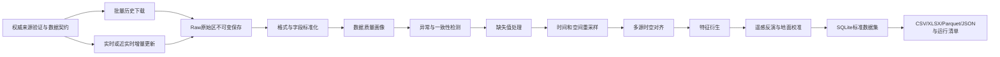

# 太湖蓝藻多源数据清洗与时空融合工作流

> 项目代号：A23 Data Cleaning  
> 当前阶段：公开数据可运行版（2026-08-19-v1）已冻结，授权增强版待外部资料  
> 研究区域：太湖  
> 数据库：SQLite  
> 工作区边界：本任务的文档、接入脚本、清洗算法、样本、数据库和测试均放在 `data-cleaning/` 内，不修改外部驾驶舱和算法文件。  
> 交付形态：这是数据工程任务流程，不建设页面、网站或业务应用。

## 当前审计结论

- 工程流程与历史实验：已完成公开数据集成、清洗、重采样、对齐、特征、交付和恢复回放；
- 真实太湖高频水质/藻情：仍未接入，是业务化短临状态更新的首要外部阻塞；
- 1—3天和7—15天：已生成192/576条观测标签样本并完成按采样日期分组的无泄漏拆分；
- 30—90天：已有3,904条候选标签和当前90天集合预报，但历史C3S回报资料未授权，因此不标记为正式训练集；
- 遥感：已真实下载Sentinel-2 L2A波段并完成部分湖区NDCI/MCI/FAI和实验性Chl-a反演；覆盖66.69%，校准R²为负且100%超出训练域，禁止作为业务真值；
- 机理+AI提升10%：当前未达标，不对外作达标表述；
- SQLite/CSV/Parquet：已生成版本`2026.08.19-v1`及逐文件SHA-256；完整宽特征以Parquet为准。

正式材料：

- [Luna执行总计划：逐步骤、逐门禁、逐验收](docs/LUNA执行总计划_太湖蓝藻数据清洗全流程_2026-08-18.md)
- [Luna机器可读执行检查表](config/luna_execution_checklist.csv)
- [太湖蓝藻多源数据全量接入与清洗重构方案](docs/太湖蓝藻多源数据全量接入与清洗重构方案_2026-08-18.md)
- [数据清洗任务状态审计报告](docs/数据清洗任务状态审计报告_2026-08-18.md)
- [数据清洗后续详细任务规划](docs/数据清洗后续详细任务规划_2026-08-18.md)
- [最终执行审计与剩余人工事项](docs/最终执行审计与剩余人工事项_2026-08-19.md)

## 阶段26：授权水站文件投递区与初始预检

新增`run-batch --through`命令，默认执行“清洗→质量报告”，也可选择贯通到`resample`、`align`、`features`、`coverage`、`labels`、`split`、`gate`或`remediation`。真实验证批次`taihu_wp3_20260818_07`已将清洗、质量、重采样、时空对齐、因果特征、覆盖率、多时间尺度标签、训练/验证/测试切分、训练输入门禁和P0数据补齐清单放入同一`storage/runs/<run_id>/`目录，并生成批次级SQLite、阶段清单、总清单和`latest.json`。当前生成4项开放P0请求：历史高频目标/驱动、准实时水站/浮标、1—3天目标序列、7—15天目标序列。

新增`waterstation-preflight`只读预检命令。它递归扫描授权JSON/CSV/TSV/XLSX文件，按SHA-256识别重复文件，解析标准字段，汇总站点/变量/时间和单位质量，并运行P0水站门禁；不会写入主清洗数据库。

```powershell
python -m pipeline waterstation-preflight --input-root <授权水站文件目录> --output-root <预检输出目录>
```

预检通过后再运行`waterstation-batch-dir`；预检不通过时只返回问题清单，不污染正式批次。

已建立`storage/raw/authorized_waterstation/`固定投递区，包含字段模板、授权登记模板和运行说明。初始预检`waterstation_preflight_20260818T141950Z`只发现空白字段模板，返回`blocked_no_valid_files`；该结果证明流程没有把模板误判为真实观测。真实授权文件放入后直接复跑同一命令。

```powershell
python -m pipeline run-batch --raw-root storage\raw --runs-root storage\runs --run-id <run_id> --through coverage --as-of 2026-08-18T00:00:00+00:00
```

```powershell
python -m pipeline run-batch --raw-root storage/raw --runs-root storage/runs --run-id taihu_wp3_20260818_01 --as-of 2026-08-18T00:00:00+00:00
```

## 1. 项目目标

本地文件适配器依赖`PyYAML`和`openpyxl`，可按`requirements.txt`安装。

本项目聚焦“互联网多源数据接入、批量历史数据下载、实时增量更新、质量控制、重采样、时空对齐、特征衍生、遥感反演校准、SQLite 入库、实验数据切分和首轮机理+AI训练接口”；不负责最终业务预警页面、SHAP解释和数字孪生展示。

最终交付一套配置驱动、可重复运行的数据处理流水线。流水线既能从权威互联网来源拉取实时/近实时数据和历史批量数据，也能处理团队后续放入指定目录的各种本地数据。一次运行后获得：

1. 清洗后的标准化表格；
2. 被拒绝记录及拒绝原因；
3. 缺失、重复、异常、一致性和时效性报告；
4. 插补前后对照和插补标记；
5. 按小时或按日重采样后的数据；
6. 站点、气象、遥感和水文数据的时空对齐结果；
7. 可直接用于后续模型实验的特征表；
8. 保存上述结果的 SQLite 数据库；
9. CSV、XLSX、Parquet、JSON 和 SQLite 等实验数据；
10. 含状态、行数、质量指标、输出表名和文件路径的明确运行返回值。

## 2. 范围与非目标

### 2.1 本项目包含

- 从配置的互联网数据源批量下载和增量更新；
- 从指定目录读取 CSV、TSV、XLSX、JSON 等本地表格；
- 水质自动站、人工采样、气象、水文、遥感反演结果的字段映射；
- 文件编码、时间、坐标、单位和缺失标记标准化；
- 完整性、唯一性、有效性、一致性、时效性、空间合理性检查；
- 异常检测、缺失值插补、重复记录处理；
- 小时、日和自定义时间尺度重采样；
- 站点—时间及网格—时间对齐；
- 数据血缘、规则版本、清洗批次和质量标志记录；
- SQLite 数据库存储和查询；
- 清洗结果统计、文件导出、SQLite查询和程序返回值。

### 2.2 分阶段实现项

- NetCDF、GRIB、GeoTIFF、Sentinel SAFE 数据解析；
- Sentinel-2 云掩膜、湖体裁剪及遥感指数计算；
- 增加更多正式授权数据源及断点续传能力；
- 空间插值、湖区网格化和卫星—站点配准；
- 大文件分块、并行任务和跨机器调度。

### 2.3 不在本项目内

- 蓝藻机理方程求解；
- LSTM、Transformer、XGBoost 训练；
- 模型精度提升 10% 的融合实验；
- SHAP、风险预测和预警决策；
- 原数字孪生驾驶舱的页面改造。
- 上传页面、清洗网站、用户账号和Web交互界面。

## 3. 总体工作流



每一步都必须保留输入行号、原值、处理后值、使用规则、处理原因、算法版本和时间戳。任何修复都不得覆盖原始数据。

## 4. 严格按照赛题拆分的六个任务

### 任务一：确定蓝藻机理和数据清洗所需数据

工作内容：

1. 检索蓝藻水华形成、迁移和遥感监测相关的权威论文、硕博论文、标准、政府报告、GitHub开源代码及公开教学资料；
2. 从藻类生长动力学、水动力输运、营养盐循环和遥感反演公式反推输入变量；
3. 按“预测目标、机理驱动、空间迁移、遥感观测、辅助质控、元数据”分类；
4. 对每个字段说明为什么需要、缺失会影响哪个过程、是否可用代理变量；
5. 区分原始观测、反演值、插补值、衍生值、静态参数和模型标签。

固定输出：

- `docs/蓝藻模型数据字典.md`；
- `config/variables.yml`；
- `config/aliases.yml`；
- `config/units.yml`；
- 文献证据表及引用链接。

完成标准：所有必需字段都有名称、定义、单位、频率、粒度、来源、必需性、缺失影响和证据来源。

### 任务二：寻找并验证至少两类真实可接入数据源

首选验证四类来源，而不是只满足最低两类：

1. 遥感：Copernicus Sentinel-2 L2A，必要时补充MODIS或Sentinel-3；
2. 地面水质：中国环境监测总站、江苏/无锡/苏州公开平台或项目方正式共享数据；
3. 气象：中国气象局CLDAS实况、CMA-GFS预报或具有明确授权的数据产品；
4. 水文：太湖流域管理局水位、水情月报及可申请的入出湖流量。

每个数据源必须实际验证：

- 机构和权威性；
- 公开页面与正式接口地址；
- 请求方式、认证方式和请求示例；
- 可返回字段及与数据字典的覆盖率；
- 历史起止时间、空间范围、更新频率、实际延迟；
- 能否批量下载、增量更新和断点续传；
- 样例文件或样例响应；
- 实测缺失率、异常率和站点覆盖率；
- 科研、比赛展示和商业使用的授权风险；
- 接口失效时的替代来源。

固定输出：

- `docs/数据源可接入性验证报告.md`；
- `scripts/verify_sources.py`；
- `pipeline/sources/`下各来源接入脚本；
- `samples/source_samples/`下脱敏样例；
- `storage/manifests/source_verification.json`。

完成标准：至少遥感+气象或遥感+水质两类来源能够重复运行并取得真实样例；仅有网址、不产生数据不算完成。

### 任务三：评估无法获得数据的替代方案和推演影响

每个缺失变量分为四档：

- A：不可缺失，缺失则无法训练或验证，例如叶绿素a/藻密度/水华面积至少一个目标；
- B：可短期估算，但会显著降低机理可信度，例如水温、TN、TP、风向；
- C：可使用代理变量，例如PAR由短波辐射估算、PO4-P在简化模型中由TP代理；
- D：第一版可不使用，例如毒素、种属、浮游动物，但必须记录能力边界。

对每个替代方案执行遮蔽实验：在完整样本中人为移除该变量，比较插补前后误差、特征覆盖率及后续模型指标变化。未经实验不能声称“没有影响”。

固定输出：

- 数据缺口与推演影响矩阵；
- 代理变量说明；
- 补采/申请数据清单；
- 遮蔽实验记录。

### 任务四：形成两份正式数据材料

必须形成并持续更新：

1. 《蓝藻模型数据字典》：字段、定义、单位、原始频率、标准频率、来源、粒度、是否必需、合理范围、缺失策略；
2. 《数据源可接入性验证报告》：真实接口、请求参数、样例、字段覆盖、历史范围、更新延迟、缺失率、稳定性和授权风险。

两份材料必须与配置文件、SQLite结构和实际样例一致，不允许文档写一个字段而代码使用另一个字段。

### 任务五：研究、选择并验证数据质量控制算法

工作内容：

1. 从权威论文、标准、硕博论文和成熟开源项目中搜索质量控制方法；
2. 为水质、气象、水文、遥感分别选择规则，不把同一算法套到所有数据；
3. 建立故障注入样本，包括缺失、重复、单位错误、时间错位、尖峰、漂移、卡死和坐标异常；
4. 评价异常检测召回率、误报率、插补MAE/RMSE和清洗后完整率；
5. 固化为版本化规则配置和可重复测试。

固定输出：

- `docs/数据质量控制算法方案.md`；
- `config/qc_rules.yml`；
- 质量算法代码；
- 故障注入数据和算法对比结果；
- 推荐算法、参数及不适用条件。

### 任务六：运行数据处理、重采样、对齐并构建SQLite数据集

工作内容：

1. 按任务二验证的来源批量下载历史数据；
2. 按各来源更新频率执行增量拉取；
3. 原始数据及下载清单不可变保存；
4. 执行格式、字段、时间、坐标和单位标准化；
5. 执行异常检测、一致性校验、去重和缺失值处理；
6. 按小时/日重采样；
7. 执行站点—气象—水文—遥感时空对齐；
8. 衍生氮磷比、滚动特征、累计温度、静风时长、营养盐负荷、遥感指数等特征；
9. 进行叶绿素a、藻密度或水华面积反演，并使用地面同期数据校准；
10. 写入SQLite标准表，导出模型实验需要的表格和运行清单。

固定输出：

- `cleaned_observations`清洗长表；
- `station_hourly_features`站点小时特征表；
- `station_daily_features`站点日特征表；
- `grid_daily_features`网格日特征表；
- `remote_sensing_products`反演产品表；
- `qc_issues`和`rejected_records`质量问题表；
- CSV、XLSX、Parquet、JSON和SQLite；
- 每次运行的`run_manifest.json`与质量报告。

完成标准：其他成员无需阅读清洗代码，只需根据数据字典读取输出表，就能直接开始模型实验。

## 5. 单次数据流水线执行流程

### 步骤 1：生成运行配置

运行配置包含：

- 任务名称；
- 数据类型：水质、气象、水文、遥感反演、站点信息或通用表格；
- 数据来源及来源说明；
- 数据时区；
- 目标时间粒度：原始、小时、日；
- 目标空间粒度：站点或网格；
- 是否允许自动插补。

流水线生成 `run_id`，作为一次清洗全流程的唯一编号。

### 步骤 2：联网接入或读取本地数据并体检

本地补充数据首版支持：

- `.csv`、`.tsv`；
- `.xlsx`；
- 行式或数组式 `.json`。

体检内容：

- 文件类型、大小、编码和工作表；
- 行列数、表头、字段类型；
- 前 20 行安全预览；
- 空列、重复列名、合并单元格；
- 候选时间列、经纬度列、站点列和指标列；
- 是否可能为宽表或长表；
- 是否包含公式、错误单元格或不可解析值。

体检不修改数据。

联网数据由适配器按数据契约直接映射；本地未知数据先体检再映射。

### 步骤 3：字段映射

系统根据别名自动映射；无法唯一判断的字段进入待确认清单，不得猜测后继续。例如：

| 输入字段 | 标准字段 | 转换 |
|---|---|---|
| 监测时间、datetime、time | `observed_at` | 转为标准时间 |
| 站点、断面名称、site | `station_name` | 名称标准化 |
| 经度、lon、lng | `longitude` | 转为 WGS84 十进制度 |
| 纬度、lat | `latitude` | 转为 WGS84 十进制度 |
| 水温、WT | `water_temperature` | 转为 ℃ |
| 叶绿素a、Chl-a | `chlorophyll_a` | 转为 μg/L |
| 藻密度、cell density | `algae_density` | 转为 cells/L |

未知字段允许保留为扩展字段，但必须记录原字段名和原单位。字段确认通过配置文件完成，不建设交互页面。

### 步骤 4：加载质量规则

默认规则来自数据字典，项目成员可在YAML配置中修改：

- 合法范围；
- 最大时间间隔；
- 异常检测算法和阈值；
- 连续缺失最大可插补长度；
- 聚合函数；
- 时间和空间匹配容差；
- 冲突记录保留策略。

规则配置必须版本化，确保同一批数据可以复现。

### 步骤 5：执行清洗

执行顺序固定为：

1. 类型与格式转换；
2. 缺失标记归一化；
3. 编码、时间、坐标和单位标准化；
4. 完全重复和业务键重复检测；
5. 合法范围及领域规则检测；
6. 时间序列异常、漂移和卡死检测；
7. 跨字段一致性校验；
8. 缺失值插补；
9. 时间重采样；
10. 空间与多源时间对齐；
11. 清洗后复检；
12. SQLite 入库和报告生成。

### 步骤 6：检查运行结果并导出

运行报告和SQLite统计表返回：

- 原始行数、有效行数、拒绝行数；
- 清洗前后完整率；
- 各字段缺失率；
- 重复率、异常率、插补率；
- 每类质量问题数量及严重度；
- 原值与清洗值对照；
- 质量问题随时间和站点的分布；
- 重采样和多源对齐覆盖率。

流水线写出清洗表、拒绝表、问题明细、质量报告及SQLite数据库。

## 6. 标准数据粒度

系统必须显式区分以下数据粒度，禁止未经声明混表：

| 数据集 | 主键/候选键 | 用途 |
|---|---|---|
| 站点主数据 | `station_id` | 站点名称、坐标、湖区和来源 |
| 原始观测长表 | `batch_id + source_row + variable_code` | 保存不可变原值 |
| 清洗观测长表 | `dataset_id + station_id + observed_at + variable_code + depth_m` | 标准水质、气象、水文序列 |
| 遥感网格表 | `scene_id + grid_id + observed_at + variable_code` | 水华面积和遥感反演值 |
| 站点小时表 | `station_id + time_hour` | 短临预报特征 |
| 站点日表 | `station_id + date` | 常规模型训练 |
| 网格日表 | `grid_id + date` | 空间风险推演 |

## 7. 数据质量算法方案

### 7.1 完整性检查

- 必填字段空值率；
- `""`、空格、`NA`、`N/A`、`null`、`--`、`-9999` 等哨兵值识别；
- 按字段、站点、日期、来源统计缺失率；
- 最大连续缺失长度；
- 预期时间点与实际时间点覆盖率；
- 最近数据延迟和缺失分区。

### 7.2 唯一性检查

- 完全重复行；
- 文件内重复业务键；
- 多文件、重复下载批次或增量窗口重叠导致的重复记录；
- 同一站点、同一时间、同一指标的冲突值；
- 文本标准化后的近重复站点名称。

冲突值默认不静默删除：若质量级别不同，优先保留高质量记录；否则保留全部并标记冲突，进入人工复核清单。

### 7.3 有效性检查

- 数字、时间、经纬度和枚举格式；
- 单位是否可识别和转换；
- 经纬度是否位于太湖研究范围附近；
- 时间是否为未来时间或异常早期时间；
- 数据字典规定的物理范围；
- 水华等级与藻密度区间是否匹配。

合法范围分为：

1. 物理不可能范围：直接拒绝或置空；
2. 太湖业务合理范围：标记高风险异常；
3. 统计异常范围：不自动删除，只标记并进入后续判断。

### 7.4 异常检测

首版同时保留规则法和统计法：

- IQR：适合快速发现分布异常；
- MAD/Hampel：抗极端值，作为时间序列默认算法；
- 滚动中位数偏差；
- 一阶差分/变化率阈值；
- 长时间平线和传感器卡死；
- 突然阶跃、漂移和重置；
- Isolation Forest：多变量增强选项；
- 站点间或相邻网格空间异常：后续阶段加入。

异常检测结果只能产生质量标记；除物理不可能值外，不得默认删除真实水华峰值。

### 7.5 一致性校验

- 同一指标不同单位转换后是否一致；
- 站点名称与站点编码是否一一对应；
- 经纬度与站点主数据是否明显冲突；
- 观测深度、表层/剖面标志是否一致；
- 水温、气温、时间和季节的合理关系；
- 总量与分量关系，例如可利用形态不得无解释地大于总量；
- 风速与U/V分量计算是否一致；
- 风向必须归一到 `[0, 360)`；
- 水华面积不得大于有效湖面面积；
- 相同遥感场景的水华像元数、像元面积和总面积应一致。

### 7.6 缺失值插补

插补策略按变量、缺失长度和用途选择，不采用“一种算法填所有字段”。

| 场景 | 推荐方法 | 约束 |
|---|---|---|
| 单点或短缺口连续传感器 | 线性/时间插值 | 仅限配置的最大间隔 |
| 平稳气象短缺口 | 时间插值或相邻格点 | 保留来源和误差 |
| 非线性多变量缺失 | KNN或Iterative Imputer | 只在训练区间拟合，防止泄漏 |
| 季节性序列 | 同站历史季节中位数 | 必须标记低置信度 |
| 长连续缺口 | 不自动填充 | 保留缺失并输出阻断警告 |
| 叶绿素a、藻密度等标签 | 默认不插补为实测值 | 可另存“估算值”，禁止伪装成实测 |
| TN、TP低频人工采样 | 前向保持只用于状态特征 | 设置最大有效期，超过后置空 |

所有插补记录：`is_imputed`、`imputation_method`、`imputation_confidence`、`original_value`。

### 7.7 质量标志

初步标志体系：

- `Q00`：通过；
- `Q01`：原始缺失；
- `Q02`：类型转换失败；
- `Q03`：观测时间缺失或无法解析；
- `Q04`：超物理范围；
- `Q05`：统计异常；
- `Q06`：经纬度格式非法；
- `Q07`：经纬度超出地理范围；
- `Q08`：重复；
- `Q09`：业务键冲突；
- `Q10`：必需单位缺失；
- `Q11`：单位与标准字段不兼容；
- `Q12`：空间位置异常；
- `Q20`：已插补；
- `Q21`：已单位转换；
- `Q22`：已重采样；
- `Q23`：已生成时空对齐判定但空间信息不足或未匹配（必须结合`match_status`解释）；
- `Q24`：对齐候选发生在目标时刻之后，已拦截以避免未来信息泄漏；
- `Q30`：遥感像元缺少关键元数据、坐标或反射率超范围；
- `Q31`：遥感指数所需波段缺失；
- `Q32`：云层或水体质量层缺失，已降级处理；
- `Q33`：遥感水华/叶绿素结果尚未完成地面校准，仅为试验性结果；
- `Q34`：场景有效水体覆盖率过低；
- `Q35`：遥感像元坐标非法；
- `Q90`：人工确认通过；
- `Q99`：拒绝入标准数据集。

一条记录允许同时拥有多个标志。

## 8. 重采样与时空对齐

### 8.1 时间标准

- 原始时间和原始时区必须保留；
- 系统内部统一保存UTC时间；
- 表格导出默认使用 `Asia/Shanghai`，数据库同时保留带时区的标准时间；
- 日尺度统计按北京时间自然日计算；
- 禁止把只含日期的数据自动解释为UTC零点而导致日期偏移。

### 8.2 重采样规则

不同变量必须使用不同聚合函数：

| 变量类型 | 小时/日聚合 |
|---|---|
| 水温、pH、DO、TN、TP、叶绿素a | 均值、中位数、最小、最大、标准差、有效计数 |
| 藻密度 | 中位数、均值、最大值、有效计数 |
| 降水 | 求和 |
| 风速 | 均值、最大值 |
| 风向 | 向量平均，禁止普通算术平均 |
| 水位 | 均值、最小、最大、末值 |
| 流量 | 均值、累计量按业务定义计算 |
| 水华面积 | 同场景最大或质量最优场景值 |

当时间桶有效覆盖率低于阈值时，结果保留但标记为低质量，不直接当作完整数据。

### 8.3 多源时间对齐

- 主时间轴可选择站点小时或站点日；
- 高频数据先聚合，不得先与低频数据做笛卡尔连接；
- 气象格点按站点坐标提取最近格点或双线性插值；
- 遥感与地面实测采用可配置时间窗，例如同日或前后若干小时；
- 人工采样允许最近邻匹配，但必须返回时间差；
- 未匹配数据不得静默丢失，应统计匹配覆盖率。

### 8.4 空间对齐

- 标准坐标系为WGS84（EPSG:4326）；
- 所有源坐标系必须记录；
- 站点数据关联标准站点主表；
- 遥感数据裁剪到正式太湖边界；
- 站点—像元匹配同时记录距离、像元质量和云污染；
- 首版仅做站点和最近网格匹配，空间插值在增强阶段实现。

### 8.5 阶段5实际运行结果

阶段5命令会分别写出 `resampled_observations.csv`、`resample_gaps.csv` 和
`temporal_alignments.csv`，并在 `storage/data_cleaning.db` 中物化
`resampled_observations`、`resample_gaps`、`temporal_alignments` 三张表。

本轮使用 `cleaning_20260818T095733Z` 的 80,539 条清洗记录（最新运行：`resample_20260818T101721Z`，对齐运行：`align_20260818T101739Z`）：

| 结果 | 行数 |
|---|---:|
| 重采样标准表 | 80,539 |
| 缺失时间桶掩码 | 3,368 |
| 季度水质记录（native） | 5,760 |
| 年度藻密度记录（native） | 16 |
| 对齐审计行 | 98,226 |
| 时间—空间匹配 | 51,845 |
| 仅时间匹配（缺统一坐标） | 22,831 |
| 未匹配 | 23,550 |

日桶按 `Asia/Shanghai` 自然日计算后以带时区UTC时间存储；降水按桶求和，风向用圆周均值，其他连续变量取均值。季度/月度/年度源只保留原生记录，不向小时或日频复制。对齐表保留 `time_gap_hours`、`space_gap_m`、`spatial_status` 和 `match_status`；没有站点主表坐标时，`space_gap_m` 保持空值并加 `Q23`，不构造伪空间距离。

### 8.6 阶段6实际特征结果

阶段6最新运行使用 `align_20260818T102458Z` 和 `resample_20260818T101721Z`，运行清单为 `storage/manifests/features_20260818T102516Z.json`。输出 `feature_dataset.csv` 为一条目标观测一行的宽表，SQLite中对应 `feature_dataset` 和 `feature_quality_summary`。

本轮输出 5,778 行、18 个对齐驱动变量及其质量统计，包含：

- `tn_tp_ratio`：TN/TP质量比，仅在两个值均存在且TP>0时计算；
- `dissolved_inorganic_nitrogen`：NH4-N、NO3-N、NO2-N齐全时求和；
- `target_lag_1d/3d/7d`、`target_rolling_mean_3d/7d/30d`；
- 各驱动变量的滞后、滑动均值及有效计数；
- `temperature_degree_days_7d`：7日因果温度积算；
- `wind_calm_duration_h`：风速低于2 m/s的连续静风时长；
- 每个驱动变量的时间差、空间距离、匹配状态和来源编号。

未来最近邻候选全部拦截并标记 `Q24`：本轮拦截6个候选、涉及2行，`accepted_future_values=0`。这保证特征表不把目标时刻之后的观测带入训练输入。气温用于温度积算时记录 `temperature_degree_days_basis=air_temperature`，表示当前无同步水温时的代理特征，不等同于水温实测。

### 8.7 阶段7遥感处理实现与可接入性限制

阶段7已实现本地Sentinel-2 L2A像元表处理，但当前联网验证只获得STAC目录元数据，产品波段匿名下载仍受OAuth/授权通道限制。因此没有把云量目录记录伪装成反射率，也没有生成未经校准的Chl-a数值。真实波段文件放入`storage/raw/local/`后执行`remote-index`即可生成像元表和场景摘要；要求输入明确包含场景时间、坐标、B03/B04/B05/B08/B11、SCL或水体掩膜、云概率和像元面积。

计算规则：`NDWI=(B03-B08)/(B03+B08)`；`FAI`使用B04/B08/B11的线性基线；`MCI`使用B04/B05/B08的红边基线。场景水华面积只统计通过水体和云掩膜的疑似水华像元，类别为`疑似`而非`确认`。每个像元保留`Q30`—`Q35`质量标志；没有地面Chl-a配对时`remote_chlorophyll_a`为空并标记`Q33`。

`remote-pair`使用时间容差和Haversine空间距离生成配对审计表；`remote-calibrate`要求至少10个有效配对，按时间排序保留末20%作为验证集，拟合`log1p(Chl-a)`线性模型并输出R²/RMSE/MAE。样本不足时返回`blocked_insufficient_ground_truth`，不输出伪校准模型。

### 8.8 阶段8实验切分实际结果

阶段8使用 `features_20260818T102516Z/feature_dataset.csv`，最新运行清单为 `storage/manifests/experiment_20260818T104457Z.json`。默认按北京时间日期块切分，同一天的不同站点、变量和场景不会跨集合。

| 集合 | 行数 | 时间范围 | 站点/分组数 |
|---|---:|---|---:|
| train | 3,972 | 2005-01-01—2016-01-01 | 9 |
| validation | 902 | 2016-02-01—2018-05-01 | 9 |
| test | 904 | 2018-08-01—2025-06-01 | 10 |

审计结果：重复目标键0条，时间顺序检查通过，缺失时间排除0条，未来特征接受数0条。测试集包含2025年遥感目录场景，因此其站点分组显示`__MISSING__`，这是当前遥感元数据缺少站点编号的真实状态，不是伪造站点。

### 8.9 阶段9机理特征与AI基线实际结果

新增 `pipeline/modeling.py` 和 `train` 命令。训练只读取阶段8已经切分的 `train.csv`、`validation.csv`、`test.csv`，并对同名目标特征和`target_rolling_*`执行硬排除。机理模块输出温度、氮、磷、光照、风速限制因子及`mechanism_growth_index`，缺失驱动保留中性因子、缺失计数和代理温度来源；AI模块当前支持随机森林和HistGradientBoosting，默认先跑随机森林。

太湖目标=`phytoplankton_biomass`的实测运行：

| 运行 | 配置 | 行数 | 测试R² | 测试RMSE |
|---|---|---:|---:|---:|
| `model_20260818T105049Z` | 机理特征级联+随机森林 | 396/90/90 | -0.564 | 5.614 |
| `model_20260818T105100Z` | 随机森林对照 | 396/90/90 | -0.600 | 5.678 |
| `model_20260818T105530Z` | 机理基线残差+随机森林 | 396/90/90 | -0.599 | 5.675 |
| 中位数基线 | 训练集目标中位数 | 396/90/90 | -0.134 | 4.780 |

本轮证明训练、预测、指标、特征重要性、模型文件和SQLite表均可复现；同时提供`mechanistic_residual`接口：有`target_lag_1d`时以机理状态预测拟合残差，无滞后时明确使用训练集目标中位数回退并写入`mechanism_state_source`。每次运行的完整结果保存在独立导出目录和manifest，SQLite物化表默认反映最后一次训练调用。本轮不宣称满足赛题“精度提升不低于10%”：当前THQBCA标签是低频浮游植物生物量，且缺少同步Chl-a/藻密度和1—3天预报标签。相关限制和下一步补数要求见《数据源可接入性验证报告》阶段9章节。

### 8.10 阶段10多时间尺度标签实际结果

新增 `pipeline/forecast_labels.py` 和 `horizon-labels` 命令。标签匹配要求未来记录与当前记录拥有完全相同的来源、站点、场景和变量键，且未来时间严格大于当前时间；不插值、不前向填充，保留实际时间差、未来记录分区和阻断原因。

太湖目标=`phytoplankton_biomass`实际运行（576行、9条序列）：

| 预测窗口 | 有效标签 | 可用率 | 结论 |
|---|---:|---:|---|
| 1—3天 | 0 | 0% | `blocked_no_labels` |
| 7—15天 | 0 | 0% | `blocked_no_labels` |
| 30—90天 | 144 | 25% | `ready`，实际间隔89—90天 |

产物为 `storage/manifests/horizon_labels_20260818T110012Z.json` 及对应的`forecast_label_dataset.csv`、`forecast_label_summary.csv`和SQLite表`forecast_label_dataset`/`forecast_label_summary`。这证明当前数据只能支持部分季度尺度标签，不能用于1—3天或7—15天模型训练；短临预测必须新增连续水质、浮标/自动站和数值天气预报数据。

### 8.11 阶段11短临字段覆盖矩阵实际结果

新增 `pipeline/coverage.py` 和 `coverage` 命令，按短临预测的必需字段检查行数、有效值、来源、站点、时间范围、来源粒度、中位时间间隔、值来源和新鲜度。`short_term_ready`表示历史训练字段是否满足要求，`operational_short_term_ready`还要求最新观测距审计时间不超过30天。

对 `resample_20260818T101721Z/resampled_observations.csv` 的8万余条记录实测（审计时间 `2026-08-18`）：

| 缺口 | 当前状态 | 影响 |
|---|---|---|
| `chlorophyll_a` | 无记录 | 没有高频Chl-a标签 |
| `algae_density` | 年度/低频，间隔约8760小时 | 不能用于短临监督标签 |
| `bloom_area_km2` | 无记录 | 没有水华面积标签 |
| `water_temperature` | 无记录 | 机理温度限制只能使用气温代理 |
| `total_nitrogen`、`total_phosphorus` | 间隔约2208小时 | 营养盐驱动过稀疏 |
| 气温、风速、风向、降水、短波辐射 | 小时/日粒度，但距审计时间441天 | 可用于历史训练，不能作为当前实时驱动 |

结果：`short_term_ready=false`、`operational_short_term_ready=false`，共11条缺口记录。产物为 `storage/manifests/coverage_20260818T111604Z.json`、`coverage_matrix.csv`、`coverage_gaps.csv`及SQLite表`coverage_matrix`/`coverage_gaps`。

### 8.12 阶段12小时级气象预报接入实际结果

新增 `pipeline/sources/open_meteo.py`，并接入原始留存、标准化、单位记录、质控和SQLite清洗链。命令：

```powershell
python -m pipeline ingest --source open_meteo --longitude 120.30 --latitude 31.20 --forecast-days 3
python -m pipeline clean --raw-root storage/raw
```

实际请求返回72个小时、5个变量（气温、风速、风向、降水、短波辐射），原始响应保存于`storage/raw/open_meteo_forecast/`；清洗后进入 `cleaning_20260818T112223Z/cleaned_observations.csv`，共360条预测驱动记录，`value_origin=forecast_proxy`。来源只作为气象预报补充，不替代水温、水质或官方CMA产品。

接入后重新覆盖审计（`coverage_20260818T112355Z`）显示：气温、风速、风向、降水、短波辐射已达到小时级且新鲜，但Chl-a、藻密度、水华面积、水温、TN、TP的P0缺口仍在；`operational_short_term_ready=false`保持不变。

### 8.13 阶段13水质自动站协议适配器

新增 `pipeline/sources/water_station.py`，支持生态环境部自动站协议字段和项目常用中英文别名：`w01016`（叶绿素a）、`w19011`（藻密度）、`e01001`（水温），以及总氮、总磷、pH、溶解氧等宽表/长表字段。支持用户提供的JSON接口、JSON/CSV/XLSX文件；接口认证不写入代码，原始响应由`waterstation-fetch`保存后再进入`clean`。

当前没有验证到可匿名下载的太湖实时水质端点，所以阶段13不生成伪造水质记录，只交付协议兼容解析器和授权边界。拿到水站账号或导出文件后执行：

```powershell
python -m pipeline waterstation-fetch --url <站点JSON接口> --source-id taihu_water_station
python -m pipeline clean --raw-root storage/raw
python -m pipeline coverage --input storage/exports/cleaning_<run_id>/cleaned_observations.csv --as-of <审计时间>
```

### 8.14 阶段14水质自动站入模质量门禁

新增 `pipeline/station_validate.py` 和 `waterstation-validate` 命令。门禁在模型前检查：P0目标是否至少存在一个、温度/TN/TP是否齐全、协议单位是否已转为标准单位、时间和站点是否完整、重复键、数值范围、中位采样间隔和最大缺口。

对当前含Open-Meteo的清洗结果 `cleaning_20260818T112223Z/cleaned_observations.csv` 实测：共80899行，其中1168行属于P0字段，全部通过基础格式/范围/重复检查；有效变量为TN 576条、TP 576条、藻密度16条，水温0条，采样中位间隔2208小时，最终门禁状态为 `blocked_missing_drivers`，同时存在严重低频问题。产物为 `station_validation_20260818T113650Z` 的验证清单、问题表、汇总JSON和SQLite表。

```powershell
python -m pipeline waterstation-validate --input storage/exports/cleaning_<run_id>/cleaned_observations.csv
```

### 8.15 阶段15国家地球系统科学数据中心太湖专题探测

新增 `pipeline/sources/lake_geodata.py` 和 `lake-geodata-probe` 命令，对国家地球系统科学数据中心湖泊—流域分中心的太湖专题页、太湖浮游植物目录和太湖水质目录执行实际HTTP探测，并把原始HTML、页面摘要、访问状态和授权边界写入文件及SQLite。探测器只读取公开元数据，不从网页说明中生成水质数值。

```powershell
python -m pipeline lake-geodata-probe
```

专题页公开说明2008年至今形成太湖蓝藻遥感产品（叶绿素、藻蓝素、温度和水华面积），并说明太湖常规观测数据持续更新；但样例/完整数据需登录或订单审核，且平台声明未经书面许可不得复制、传播或销售。因此本阶段的实测结论是“公开元数据可访问，数据文件授权待审”，不能把页面的时间范围当成已接入记录。产物为 `storage/exports/lake_geodata_probe/lake_geodata_probe.json`、`storage/raw/lake_geodata_probe/*.html` 和SQLite表 `lake_geodata_probe`。

### 8.16 阶段16授权水站文件一键入模流水线

新增 `pipeline/waterstation_batch.py` 和 `waterstation-batch` 命令。它接收用户拿到的JSON/CSV/TSV/XLSX水站文件，或 `waterstation-fetch` 保存的原始JSON信封，依次执行：协议字段解析 → 标准长表 → 清洗/单位换算/QC → P0目标与水温/TN/TP/频率门禁，并输出一个批次清单。批次使用独立 staging 目录，只包含本次输入，不会把其它历史原始文件静默混入。

```powershell
python -m pipeline waterstation-batch --input <授权水站文件> --source-id taihu_water_station
```

输出包括 `storage/manifests/waterstation_batch_<timestamp>.json`、`storage/exports/waterstation_batch_<timestamp>/batch_summary.json`、标准化暂存文件、清洗结果和门禁结果。门禁通过时返回 `ready`，可继续 `resample → align → features → coverage → horizon-labels`；门禁不通过时返回 `blocked_by_quality_gate`，并明确缺失目标、驱动、单位、重复或低频原因，不会继续训练短临模型。

### 8.17 阶段17多文件目录接入与哈希去重

新增 `pipeline/waterstation_batch_dir.py` 和 `waterstation-batch-dir` 命令，面向多站点、多日期和多格式导出文件：递归发现JSON/CSV/TSV/XLSX，按SHA-256跳过完全重复文件，记录解析失败文件和变量覆盖，随后把所有有效文件放入同一独立staging批次，统一执行清洗和P0门禁。

```powershell
python -m pipeline waterstation-batch-dir --input-root <授权文件目录> --source-id taihu_water_station
```

输出的 `input_inventory.csv` 会逐文件记录路径、扩展名、SHA-256、解析状态、标准化行数、变量清单和错误原因；`batch_summary.json` 和Manifest记录实际纳入清洗的文件数、重复跳过数、解析失败数及最终门禁状态。完全重复文件不会再次进入模型数据集，解析失败文件不会被静默丢弃。

### 8.18 阶段18清洗质量报告与实验输入证据

新增 `pipeline/quality_report.py` 和 `quality-report` 命令，对清洗长表按 `source_id + variable_code + unit` 汇总：有效值数、缺失率、最小/最大/均值、站点数、时间范围、中位采样间隔、新鲜度、重复键、拒绝行、待插补行、质量标志、插补值、代理值和可用状态。

```powershell
python -m pipeline quality-report --cleaned storage/exports/cleaning_<run_id>/cleaned_observations.csv --as-of 2026-08-18T00:00:00Z
```

输出 `quality_report.csv`、`quality_report_overall.json`、SQLite表 `quality_report`/`quality_report_overall` 和Manifest。该报告是进入实验切分前的固定证据：`available` 可作为候选输入，`low_frequency`、`stale`、`missing` 必须在实验记录中保留，不能只看清洗后总行数。

对最新清洗结果 `cleaning_20260818T112223Z` 的实际报告：80899条清洗记录、4个来源、35个来源—变量—单位组；911条拒绝、2958条待插补、3869条QC问题、0个清洗结果重复键；5组可用、11组低频、21组过期、0组无有效值、9组仅有问题记录。产物为 `quality_report_20260818T120408Z`。

## 9. SQLite 数据库设计

首版数据库文件规划为 `data-cleaning/storage/data_cleaning.db`。

### 9.1 元数据表

- `data_sources`：来源名称、类别、机构、地址、授权说明、更新频率；
- `ingest_batches`：任务、状态、创建时间、规则版本和统计摘要；
- `raw_files`：文件名、哈希、编码、大小、工作表和保存路径；
- `schema_mappings`：原字段到标准字段、单位及转换规则；
- `variable_dictionary`：标准变量、单位、频率、必需性、合理范围；
- `stations`：站点编码、标准名称、别名、经纬度、湖区和有效期；
- `qc_rules`：规则类型、参数、适用变量、版本和启用状态。

### 9.2 数据与质量表

- `raw_observations`：不可变原始记录，使用原始JSON和来源行号保存；
- `normalized_observations`：完成格式、时间、坐标和单位标准化的记录；
- `qc_issues`：问题代码、严重度、原值、证据、建议处理；
- `cleaned_observations`：清洗后的长表记录及插补、质量标志；
- `resampled_observations`：按小时/日聚合后的结果；
- `temporal_alignments`：目标—驱动变量的一对多时间/空间匹配审计表（时间差、空间距离、匹配状态）；
- `feature_dataset`：按目标观测展开的模型实验宽表，含原始目标、对齐驱动、滞后、滑动统计和营养盐特征；
- `feature_quality_summary`：各特征的有效数、缺失数、未来值拦截数和缺失率；
- `remote_pixel_indices`：遥感像元反射率、掩膜、NDWI/FAI/MCI和水华类别；
- `remote_scene_summary`：场景有效覆盖率、水华面积和场景级质量摘要；
- `remote_ground_pairs`：遥感场景—地面叶绿素a配对及时间/空间差；
- `remote_calibration_models`：时间留出校准模型、系数和验证指标；
- `experiment_dataset`：包含`dataset_split`、时间块和站点分组的实验宽表；
- `experiment_split_summary`：训练/验证/测试行数、时间范围、分组数和缺失率；
- `model_predictions`：目标真值、AI预测、机理限制因子和质量字段；
- `model_metrics`：按模型和训练/验证/测试集合统计的R²、RMSE、MAE、SMAPE；
- `model_feature_importance`：树模型特征重要性（HistGradientBoosting无公开重要性时保留0占位）；
- `forecast_label_dataset`：按同一来源/站点/场景/变量匹配的未来多时间尺度标签及状态；
- `forecast_label_summary`：各预测窗口的可用率、时间差、阻断原因和跨分区统计；
- `coverage_matrix`：短临字段的来源、频率、时间范围、有效值和新鲜度矩阵；
- `coverage_gaps`：字段缺口、优先级和推荐接入动作；
- `station_validation_rows`：通过水站P0字段门禁的标准记录；
- `station_validation_issues`：水站缺失、重复、单位、范围和频率问题；
- `station_validation_summary`：水站目标/驱动/频率门禁汇总；
- `lake_geodata_probe`：官方湖泊专题页面HTTP状态、元数据摘要、样例/订单提示和授权边界；
- `waterstation_batch`（清单）：一次授权水站文件从解析到P0门禁的完整血缘；
- `waterstation_batch_inventory`（CSV）：多文件目录批次的哈希、解析状态和变量覆盖清单；
- `quality_report`：按来源/变量/单位汇总的清洗质量、缺失率、频率、新鲜度和代理状态；
- `quality_report_overall`：本次清洗总体行数、问题数、重复数和状态计数；
- `station_hourly_features`：站点小时级清洗及衍生特征；
- `station_daily_features`：站点日级清洗及衍生特征；
- `grid_daily_features`：网格日级遥感、气象及水动力特征；
- `remote_sensing_products`：反演值、分类结果、置信度和模型版本；
- `rejected_records`：拒绝行及原因；
- `manual_reviews`：人工确认、驳回和修订记录；
- `pipeline_runs`：运行状态、输入输出计数、时间和错误摘要；
- `export_runs`：导出格式、筛选条件、文件和状态；
- `audit_logs`：流水线动作、规则版本、开始结束时间和结果。

### 9.3 核心约束

- 原始表只追加，不更新；
- 每条清洗记录可以追溯到 `raw_file_id + source_row`；
- 清洗表业务键默认包含站点、时间、指标、深度和来源；
- 所有时间字段使用ISO 8601；
- 所有数值同时记录标准单位；
- 删除操作使用状态字段或软删除；
- 数据库启用外键和事务。

## 10. 特征衍生、遥感反演与校准

### 10.1 特征衍生清单

特征仅使用预测时刻及其之前可获得的数据，禁止使用未来观测，避免训练数据泄漏。

| 特征组 | 典型字段 | 计算方式 | 作用 |
|---|---|---|---|
| 时间与季节 | `hour`、`day_of_year`、月份正余弦 | 从标准时间生成 | 表达昼夜与季节周期 |
| 滞后特征 | `chla_lag_1d`、`tp_lag_3d` | 按站点和变量向后移位 | 描述历史状态和响应延迟 |
| 滑动统计 | 3/7/14/30日均值、极值、标准差 | 仅使用过去窗口 | 适配多时间尺度预报 |
| 趋势特征 | 3/7日斜率、环比变化率 | 稳健线性拟合或差分 | 发现快速增殖与突变 |
| 营养盐 | TN/TP、DIN、N/P限制指标、入湖负荷 | 浓度换算与流量耦合 | 描述氮磷限制和外源输入 |
| 热力与光照 | 累积水温、有效光照、日照时长 | 时间积分和窗口累计 | 描述藻类生长条件 |
| 风场 | `wind_u`、`wind_v`、静风持续时长 | 风速风向向量化 | 描述漂移、聚集和扰动 |
| 水文水动力 | 水位变化率、流量、流速、停留时间代理 | 差分或水量平衡 | 描述输运、稀释和滞留 |
| 遥感光谱 | NDWI、FAI、MCI、红边比值、云量 | 表面反射率计算 | 水体提取、水华识别和Chl-a反演 |
| 空间邻域 | 周边像元均值、上游/邻站统计、岸距 | 空间窗口或邻接关系 | 描述局部扩散与空间相关性 |
| 数据质量 | 缺失率、距最近实测时间、云覆盖、质量等级 | 从质量表生成 | 供模型感知输入可靠度 |

每个衍生字段必须登记：公式、输入字段、窗口、版本、是否可能泄漏、适用粒度和缺失传播规则。

### 10.2 叶绿素a、藻密度和水华面积反演

1. 对Sentinel-2等影像完成目录检索、下载、表面反射率确认、云/云影掩膜、水体掩膜和邻岸像元处理。
2. 计算FAI、MCI、NDWI、红边与近红外波段组合；保留原波段、指数和像元质量标志。
3. 将卫星过境时刻和地面实测按时间容差、空间距离、采样深度配对，形成校准样本；每条样本记录时间差和距离。
4. 分别建立叶绿素a浓度、藻密度或蓝藻生物量回归模型，以及水华像元分类/阈值模型。首版至少比较经验公式与一种机器学习方法。
5. 按年份、站点或湖区划分训练/验证集，不能随机拆散同一事件造成空间时间泄漏。
6. 对全湖有效水体像元推理，汇总水华面积，并输出像元级置信度、有效覆盖率、反演模型版本和校准版本。
7. 地面实测、遥感反演、插补值必须以 `value_origin` 明确区分，任何反演结果不得伪装为实测值。

### 10.3 校准与验收

| 对象 | 核心指标 | 补充检查 |
|---|---|---|
| 叶绿素a/藻密度回归 | R²、RMSE、MAE、相对偏差 | 不同季节、湖区、浓度区间误差 |
| 水华像元识别 | Precision、Recall、F1、IoU | 云边、岸边和强浑浊水体误判 |
| 水华面积 | 面积绝对误差、相对误差 | 有效覆盖率和缺测区域说明 |
| 不确定性 | 区间覆盖率、区间宽度 | 观测误差、模型误差和云缺测分开表达 |

校准系数只允许由配对样本计算，必须保存样本版本、训练时间范围、代码版本和指标。校准样本不足时只输出“试验性估计”，不能作为已验证产品。

## 11. 流水线调用方式与明确返回值

本项目不提供网页或业务应用。使用配置文件、命令行或Python函数执行，使同一输入和同一规则版本得到可复现结果。

### 11.1 命令行入口

```powershell
cd data-cleaning

# 验证数据源的连通性、授权、字段和样例
python scripts/verify_sources.py

# 下载历史数据或按游标/时间窗增量接入
python -m pipeline ingest --source sentinel2 --start 2024-01-01 --end 2024-12-31

# 将已落盘的Raw JSON标准化、质控、短缺口插补并写入CSV/SQLite
python -m pipeline clean

# 本地CSV/TSV/XLSX也可放入该目录；支持宽表（每个指标一列）或长表
# （time/时间、station_code/站点编号、variable/指标、value/数值）
mkdir storage/raw/local
python -m pipeline clean

# 阶段6之后实现：执行特征、反演、入库和实验导出（当前为预留接口）
# python -m pipeline features --input storage/exports/align_<run_id>/temporal_alignments.csv
# python -m pipeline export --run-id run_20260818_0001 --format csv parquet xlsx

# 运行标注故障样本，验证缺失、超范围、重复和无效时间是否被识别
python -m pipeline fault-test

# THQBCA历史文件：下载校验、抽取Excel、转换成长表
python -m pipeline download-thqbca
python -m pipeline extract-thqbca
python -m pipeline parse-thqbca

# 阶段5：按来源粒度重采样；季度/月度/年度数据保持native，不伪造高频实测
python -m pipeline resample --input storage/exports/cleaning_<run_id>/cleaned_observations.csv

# 阶段5：输出目标变量与气象/水文/遥感驱动的时间—空间匹配审计表
python -m pipeline align --input storage/exports/resample_<run_id>/resampled_observations.csv --max-time-diff-hours 72

# 阶段6：构建只使用当前及历史信息的特征数据集
python -m pipeline features --alignment storage/exports/align_<run_id>/temporal_alignments.csv --observations storage/exports/resample_<run_id>/resampled_observations.csv

# 阶段7：对本地Sentinel-2像元表计算质量掩膜、NDWI、FAI、MCI和场景水华面积
# reflectance-scale必须按产品元数据显式填写；uint16/10000产品通常传0.0001
python -m pipeline remote-index --input storage/raw/local/sentinel2_pixels.csv --reflectance-scale 1.0

# 阶段7：遥感场景与地面叶绿素a配对，再进行时间留出校准
python -m pipeline remote-pair --remote storage/exports/remote_index_<run_id>/remote_scene_summary.csv --ground storage/raw/local/ground_chla.csv
python -m pipeline remote-calibrate --pairs storage/exports/remote_pair_<run_id>/remote_ground_pairs.csv --features mean_fai,mean_mci,mean_ndwi

# 阶段8：按北京时间日期切分训练、验证、测试集并写出泄漏审计
python -m pipeline split --input storage/exports/features_<run_id>/feature_dataset.csv --strategy time --train-fraction 0.7 --validation-fraction 0.15

# 阶段8：按站点/湖区留出，避免同一站点随机混入不同集合
python -m pipeline split --input storage/exports/features_<run_id>/feature_dataset.csv --strategy group --group-field target_station_id --validation-groups TAIHU_WHOLE --test-groups TAIHU_CT

# 阶段9：训练机理特征级联AI模型（同一输入目录必须包含train/validation/test.csv）
python -m pipeline train --input-dir storage/exports/experiment_<run_id> --target-variable phytoplankton_biomass --algorithm random_forest --fusion mechanistic_cascade

# 阶段9：运行不含机理特征的对照基线
python -m pipeline train --input-dir storage/exports/experiment_<run_id> --target-variable phytoplankton_biomass --algorithm random_forest --fusion none

# 阶段9：机理基线残差学习（无target_lag_1d时自动标记中位数回退）
python -m pipeline train --input-dir storage/exports/experiment_<run_id> --target-variable phytoplankton_biomass --algorithm random_forest --fusion mechanistic_residual

# 阶段10：构造并审计未来1—3天、7—15天、30—90天监督标签
python -m pipeline horizon-labels --input storage/exports/experiment_<run_id>/experiment_dataset.csv --target-variable phytoplankton_biomass

# 阶段11：生成短临预测字段覆盖矩阵和缺口清单
python -m pipeline coverage --input storage/exports/resample_<run_id>/resampled_observations.csv --as-of 2026-08-18T00:00:00Z

# 阶段12：接入小时级公开气象预报补充源
python -m pipeline ingest --source open_meteo --longitude 120.30 --latitude 31.20 --forecast-days 3
```

本地文件接入约定：把文件放在`storage/raw/local/`后重新执行`python -m pipeline clean`。CSV、TSV和XLSX支持宽表和长表；宽表要求至少有“时间/监测时间”和指标列，例如“水温、总磷”；长表要求至少有“time/时间、station_code/站点编号、variable/指标、value/数值”。字段别名由`config/aliases.yml`统一映射，未识别列不会被猜测成模型变量。无效时间进入`Q03`，空值进入`Q01`，由后续插补或拒绝流程处理。

### 11.2 Python调用入口

```python
from pipeline.runner import run_pipeline

result = run_pipeline("config/pipeline_taihu.yml")
print(result.status)
print(result.tables)
print(result.files)
```

`run_pipeline` 返回 `PipelineResult`，而不是只在控制台打印。字段约定如下：

| 字段 | 类型 | 含义 |
|---|---|---|
| `run_id` | string | 本次运行唯一编号 |
| `status` | string | `completed`、`completed_with_warnings`或`failed` |
| `started_at`/`finished_at` | datetime | 运行起止时间 |
| `source_counts` | object | 各数据源读取、下载、新增和失败数量 |
| `input_rows` | integer | 输入记录数 |
| `normalized_rows` | integer | 通过格式与字段标准化的记录数 |
| `clean_rows` | integer | 可用于后续处理的记录数 |
| `rejected_rows` | integer | 无法安全修复而隔离的记录数 |
| `duplicate_rows` | integer | 识别出的重复记录数 |
| `issue_count` | integer | 质量问题总数 |
| `imputed_cells` | integer | 插补单元格数 |
| `completeness_before/after` | float | 清洗前后完整率 |
| `resampled_rows` | integer | 重采样输出记录数 |
| `aligned_rows` | integer | 多源对齐输出记录数 |
| `alignment_coverage` | float | 成功匹配占比 |
| `tables` | object | SQLite输出表名及行数 |
| `files` | object | CSV/XLSX/Parquet/报告文件绝对路径 |
| `warnings` | array | 不阻断执行的风险说明 |
| `error` | object/null | 失败阶段、错误类型和可定位信息 |

### 11.3 运行摘要示例

```json
{
  "run_id": "run_20260818_0001",
  "status": "completed_with_warnings",
  "started_at": "2026-08-18T09:00:00+08:00",
  "finished_at": "2026-08-18T09:12:46+08:00",
  "source_counts": {
    "water_quality": {"read": 5200, "new": 5100, "failed": 0},
    "meteorology": {"read": 8760, "new": 8760, "failed": 0},
    "sentinel2_scenes": {"read": 96, "new": 15, "failed": 2}
  },
  "input_rows": 14056,
  "normalized_rows": 13980,
  "clean_rows": 13260,
  "rejected_rows": 76,
  "duplicate_rows": 720,
  "issue_count": 1045,
  "imputed_cells": 468,
  "completeness_before": 0.914,
  "completeness_after": 0.972,
  "resampled_rows": 3650,
  "aligned_rows": 3210,
  "alignment_coverage": 0.879,
  "tables": {
    "cleaned_observations": 13260,
    "station_daily_features": 3210,
    "remote_sensing_products": 482000,
    "quality_issues": 1045
  },
  "files": {
    "database": "D:/Project/fuwai/2026_sheng-fuwai/data-cleaning/storage/data_cleaning.db",
    "cleaned_csv": "D:/Project/fuwai/2026_sheng-fuwai/data-cleaning/storage/exports/run_20260818_0001/cleaned_observations.csv",
    "station_daily_parquet": "D:/Project/fuwai/2026_sheng-fuwai/data-cleaning/storage/exports/run_20260818_0001/station_daily_features.parquet",
    "quality_report": "D:/Project/fuwai/2026_sheng-fuwai/data-cleaning/storage/exports/run_20260818_0001/quality_report.xlsx",
    "manifest": "D:/Project/fuwai/2026_sheng-fuwai/data-cleaning/storage/manifests/run_20260818_0001.json"
  },
  "warnings": ["2景遥感影像下载失败，已记录并等待下次增量重试"],
  "error": null
}
```

### 11.4 提供给数据实验的标准结果

每次成功运行至少产生以下成果，实验人员可以直接按表或文件读取：

| 成果 | 主要粒度 | 关键字段 | 用途 |
|---|---|---|---|
| `cleaned_observations` | 站点-时间-变量 | 原值、清洗值、单位、来源、质量标志、是否插补 | 审计和自定义实验 |
| `station_hourly_features` | 站点-小时 | 水质、气象、水文、滞后及质量特征 | 1—3天短临模型 |
| `station_daily_features` | 站点-日 | 日统计、滚动特征、标签和可用性掩码 | 7—15天和30—90天模型 |
| `grid_daily_features` | 网格-日 | 遥感、水动力、气象、空间邻域特征 | 空间预测和风险分区 |
| `remote_sensing_products` | 像元/网格-过境时刻 | Chl-a、藻密度、水华类别、置信度、有效覆盖 | 反演图层和面积统计 |
| `quality_issues` | 问题事件 | 规则、严重度、原值、处置、证据 | 质量复核 |
| `rejected_records` | 原始记录 | 拒绝原因和原始定位 | 修复源数据 |
| `run_manifest` | 运行 | 数据、规则、代码、模型和导出版本 | 完整复现 |

CSV/XLSX用于查看与交接，Parquet用于批量建模，SQLite用于按条件查询。三个格式必须来自同一标准表和同一 `run_id`，不得各自重复处理产生口径差异。

## 12. 目录结构规划

后续开发限定使用以下结构：

```text
data-cleaning/
├─ README.md                         # 本工作流和项目状态唯一入口
├─ docs/
│  ├─ 蓝藻模型数据字典.md
│  ├─ 数据源可接入性验证报告.md
│  ├─ 数据质量控制算法方案.md
│  ├─ 缺失数据影响与替代策略.md
│  └─ SQLite与实验数据说明.md
├─ pipeline/
│  ├─ cli.py                         # verify-sources/ingest/run/export命令
│  ├─ runner.py                      # 全流程编排和PipelineResult
│  ├─ contracts.py                   # 标准记录、质量问题和返回值定义
│  ├─ sources/                       # 网络源与本地文件接入器
│  │  ├─ water_quality/
│  │  ├─ meteorology/
│  │  ├─ hydrology/
│  │  └─ remote_sensing/
│  ├─ normalize/                     # 字段、时间、坐标、单位标准化
│  ├─ qc/                            # 质量规则和异常检测
│  ├─ impute/                        # 分级缺失值处理
│  ├─ resample/                      # 小时、日和事件尺度聚合
│  ├─ align/                         # 时间、站点、网格和影像匹配
│  ├─ features/                      # 无泄漏特征衍生
│  ├─ remote_sensing/                # 水体/云掩膜、指数和反演
│  ├─ calibrate/                     # 地面样本配对与模型校准
│  ├─ storage/                       # SQLite写入、迁移和查询
│  └─ export/                        # CSV/XLSX/Parquet/报告导出
├─ config/
│  ├─ pipeline_taihu.yml
│  ├─ sources.yml
│  ├─ variables.yml
│  ├─ aliases.yml
│  ├─ units.yml
│  ├─ qc_rules.yml
│  └─ feature_rules.yml
├─ scripts/
│  ├─ init_db.py
│  ├─ verify_sources.py
│  └─ backfill_history.py
├─ storage/
│  ├─ raw/                            # 按来源保存不可变原文件及响应
│  ├─ bronze/                         # 可解析但未统一的数据
│  ├─ silver/                         # 标准化和质量标记数据
│  ├─ gold/                           # 对齐后的实验数据集
│  ├─ manifests/                      # 每次运行的输入、规则和版本清单
│  ├─ exports/                        # 表格和报告
│  └─ data_cleaning.db
├─ samples/                           # 脱敏小样本与故障注入样本
├─ notebooks/                         # 来源验证和算法研究记录
├─ tests/
│  ├─ fixtures/
│  ├─ test_sources.py
│  ├─ test_normalization.py
│  ├─ test_quality.py
│  ├─ test_imputation.py
│  ├─ test_resampling.py
│  ├─ test_alignment.py
│  ├─ test_features.py
│  ├─ test_remote_sensing.py
│  └─ test_pipeline_result.py
├─ requirements.txt
└─ run_pipeline.ps1
```

运行产生的数据库、网络下载原文件和导出文件后续应通过 `.gitignore` 排除，只提交空目录说明、脱敏小样本和可复现代码。原始数据本地保留策略不等于数据许可；每个来源仍须遵守授权和再分发限制。

## 13. 开发阶段与验收门槛

阶段之间按“证据确认—代码实现—数据验证—成果冻结”推进。上一阶段的验收证据未形成，不把待验证假设写成已完成能力。

### 阶段 0：方案冻结（本轮）

交付：

- 独立 `data-cleaning/` 工作区；
- 本工作流；
- 范围、数据分层、运行方式、SQLite、明确返回值和验收标准。

验收：六项任务均有输入、处理、输出、证据和停止条件，且没有页面或业务应用开发内容。

### 阶段 1：机理变量研究与数据规范

交付：

- 检索论文、学位论文、权威规范、正式开源项目和数据门户；
- 《蓝藻模型数据字典》；
- 《数据质量控制算法方案》初版；
- 太湖湖区、站点和网格主表；
- `variables.yml`、`aliases.yml`、`units.yml`和规则依据清单。

验收：每个变量均有定义、单位、频率、机理作用、必要性、来源证据、缺失影响和替代变量；文献可定位且不以二手视频作为核心科学依据。

### 阶段 2：真实数据源接入验证

交付：

- 遥感、水质、气象、水文候选源逐项验证；
- 实际请求地址或正式下载入口、参数、鉴权、响应样例和错误样例；
- 历史时间范围、更新频率、延迟、字段覆盖、样例缺失率和授权风险；
- 《数据源可接入性验证报告》初版。

验收：至少两类数据源能够在相同环境重复获取真实样例；仅能人工查看或缺少许可的来源不得标为“已自动接入”。

### 阶段 3：历史回填与实时/准实时增量接入

交付：

- 各来源接入适配器；
- 历史时间窗批量回填；
- 按更新时间、游标或过境目录增量抓取；
- 原响应、文件哈希、请求参数、抓取时间和授权说明留存；
- 重试、断点续传、缓存、去重、限流和失败清单。

验收：重复运行不会重复写入；失败后可从断点继续；原始层不可变；每条记录能追溯到来源请求或文件。所谓“实时”按来源真实发布延迟标注为实时、准实时或定期更新。

### 阶段 4：标准化、质控、插补与SQLite

交付：

- CSV/XLSX/JSON/GeoTIFF/NetCDF等已验证格式读取；
- 字段、时间、坐标和单位标准化；
- 完整性、唯一性、有效性、一致性、时效性和分布检查；
- IQR、Hampel/MAD、变化率、卡死、漂移和跨变量规则；
- 分级缺失值处理、质量标志、隔离表和质量报告；
- SQLite原始元数据表、清洗表、问题表、运行表及表格导出。

验收：故障注入样本可计算检测召回率、误报率和插补误差；异常峰值不被静默删除；每个修复值保留原值、方法、依据和规则版本。

### 阶段 5：重采样与时空对齐

交付：

- 小时、日、事件和卫星过境尺度重采样；
- 风向向量聚合和不同变量的专用聚合规则；
- 站点—气象、站点—水文、地面—遥感、站点—网格匹配；
- 缺失时间桶掩码和匹配质量审计表；
- `resampled_observations`、`resample_gaps`和`temporal_alignments`。

验收：无笛卡尔膨胀；每条匹配保留时间差、空间距离和来源；匹配覆盖率可计算。

### 阶段 6：因果特征工程

交付：

- TN/TP比、DIN、目标和驱动滞后项；
- 3/7/30日滑动均值和有效计数；
- 7日温度积算、静风持续时间和特征质量摘要；
- `feature_dataset`和`feature_quality_summary`。

验收：所有接受的驱动满足`feature_time <= target_time`；未来候选必须拦截并标记`Q24`；代理变量记录基准；特征覆盖率和缺失率可计算。

### 阶段 7：藻类参数反演与地面校准

交付：

- 云、水体和邻岸掩膜；
- FAI、MCI、NDWI和红边特征；
- 地面—遥感配对样本；
- 叶绿素a、藻密度/生物量和水华面积的反演或识别结果；
- 校准模型、验证指标、不确定性、适用范围和版本清单。

验收：按站点、年份或湖区做独立验证；输出R²/RMSE/MAE或F1/IoU/面积误差；反演、实测和插补来源严格分开；无地面校准时明确降级为试验性估计。

### 阶段 8：实验数据集与复现交付

交付：

- SQLite数据库和脱敏样本；
- CSV/XLSX/Parquet标准实验表；
- 数据字典、来源验证报告、质量报告和使用说明；
- `PipelineResult`、运行清单、测试报告和复现实例；
- 可用于机理模型、AI模型和融合模型对比的统一训练/验证/测试数据切分。

验收：新环境按照说明能够从配置启动，完成“接入—留存—标准化—质控—插补—对齐—特征—反演/校准—SQLite—导出”；输出行数、质量指标、表名和文件路径明确可读取。

### 阶段 9：机理+AI训练与对比实验初版

交付：

- 目标同名特征和潜在泄漏列硬排除；
- 温度、氮、磷、光照、风速限制函数及缺失标志；
- 随机森林/HistGradientBoosting基线、预测表、指标表和特征重要性；
- 训练模型、配置、输入切分和SQLite结果可追溯。

验收：同一切分和随机种子可复现；训练/验证/测试指标分别输出；没有同步目标或连续预报驱动时，结果标记为“接口验收”，不得作为满足10%精度提升的证据。

### 阶段 10：多时间尺度监督标签与预测可用性

交付：

- 1—3天、7—15天、30—90天未来标签构造器；
- 同序列约束、实际时间差、未来分区和缺失原因；
- 标签可用率和阻断状态写入CSV、SQLite和manifest。

验收：没有真实未来观测时必须返回`blocked_no_labels`；不得用插值或前向填充伪造未来监督值；各窗口的标签可用率可由明细重算。

### 阶段 11：短临预测字段覆盖与新鲜度审计

交付：

- 必需目标、机理驱动和气象驱动的覆盖矩阵；
- 历史训练可用性与实时运行可用性分开判断；
- 字段缺口、优先级、来源频率和补数动作写入CSV、SQLite和manifest。

验收：缺少Chl-a/藻密度/水华面积目标或水温、TN、TP等必需驱动时，短临状态必须为false；过期来源不能标记为实时可用。

### 阶段 12—13：预报驱动与水站协议适配

交付：

- 小时级气象预报补充源及来源类型标记；
- 水质自动站协议字段、JSON/CSV/XLSX解析和用户端点原始留存；
- 授权未验证时不生成伪实时水质数据。

### 阶段 14：水站数据入模质量门禁

交付：

- P0目标和水温/TN/TP完整性检查；
- 协议单位到标准单位的显式转换和`Q21`留痕；
- 重复键、时间、站点、范围、采样间隔和最大缺口审计；
- `ready`/`blocked_missing_target`/`blocked_missing_drivers`/`blocked_low_frequency`等门禁状态。

验收：任何未通过门禁的水站数据只能进入问题表，不能直接进入短临模型训练。

## 14. 总体验收指标

### 14.1 数据源与接入指标

- 至少两类权威真实来源通过重复接入验证，目标覆盖遥感、水质、气象和水文四类；
- 每个来源记录机构、地址、鉴权、许可、时间范围、延迟、字段、样例和风险；
- 支持历史批量回填和至少一种准实时/定期增量接入方式；
- 接入失败、限流、空响应和字段变化有明确记录与重试策略。

### 14.2 数据质量与处理指标

- 支持至少CSV、XLSX、JSON及项目实际采用的遥感栅格格式；
- 支持完整性、唯一性、有效性、一致性、时效性、分布和血缘检查；
- 支持至少IQR、Hampel/MAD两类稳健异常检测和传感器卡死检测；
- 支持短缺口插补、长缺口阻断以及缺失掩码；
- 支持小时和日重采样、站点时间对齐、遥感空间配准；
- 支持标准SQLite表和CSV/XLSX/Parquet导出。

### 14.3 藻类参数与实验可用性指标

- 叶绿素a、藻密度/生物量、水华面积至少有实测、反演或可追溯代理中的一种；
- 输出值包含来源类型、质量标志、是否插补、模型版本和不确定性；
- 反演模型必须与地面样本配对并独立验证，样本不足时明确限制；
- 提供站点小时表、站点日表、网格日表及统一训练/验证/测试切分；
- 数据标签和特征的可用时间符合预测场景，不发生未来信息泄漏。

### 14.4 可追溯与工程指标

- 原始文件哈希、行数、来源、请求参数和抓取时间可追溯；
- 清洗后记录可定位到原始文件和原始行/像元；
- 业务键重复不被静默覆盖，多源连接前后行数变化有解释；
- 质量统计可由问题明细重算，所有自动修复均有规则和版本；
- 任务失败不破坏原始层，SQLite事务完整；
- 凭据不写入代码或运行清单，错误日志对密钥脱敏；
- 关键处理有自动化测试，同一输入和版本得到相同结果。

## 15. 风险与决策原则

1. 公开网页可访问不等于存在稳定开放数据服务，必须分别记录“可查看、可下载、可自动化、可商用、可再分发”。
2. 没有任何单一公开来源能稳定覆盖全部机理变量，方案必须采用多源组合并保留字段覆盖矩阵。
3. 任何代理变量、反演值和插补值都不能标记为原始实测。
4. 水华峰值可能是真实事件，统计异常算法不得默认删除峰值。
5. 长期缺失不能通过无限插值掩盖；必须保留缺失掩码并通过消融实验评估推演影响。
6. 卫星数据受云、邻岸效应和过境时间限制，必须保留像元质量、有效覆盖率和匹配时间差。
7. 字段名称相同不代表定义相同，必须核对采样深度、分析方法、空间代表性和单位。
8. 插补器、校准器和特征标准化器只能在训练时间段拟合，避免未来数据泄漏。
9. “实时”以来源的实际更新频率和延迟为准，不能把日更或卫星重访标成秒级实时。
10. 先形成可审计的原始层和标准表，再增加复杂算法；算法结果不能覆盖源数据。

## 16. 当前状态与下一项任务

当前已完成：阶段0方案冻结；阶段1初版变量研究和数据规范；阶段2首轮数据源连通性验证；阶段3首轮原始接入适配器；阶段4首轮标准化、质量控制、SQLite物化、通用CSV/TSV/XLSX输入、标注故障注入验证、单位别名归一化和显式单位换算；阶段5的THQBCA大文件下载、MD5验证、RAR目录清单、水质/气候Excel解析、小时/日重采样、缺失桶掩码和多源时间—空间对齐初版；阶段6的因果滞后、滑动统计、TN/TP比、DIN、温度积算、静风持续时间和实验宽表初版；阶段7的本地遥感像元质量掩膜、NDWI/FAI/MCI、场景水华面积、遥感—地面配对和时间留出Chl-a校准接口；阶段8的按时间块实验数据集切分、站点/湖区留出接口和泄漏审计；阶段9的机理限制因子、无泄漏AI基线、机理级联/残差对照、预测/指标/特征重要性和SQLite输出；阶段10的多时间尺度未来标签构造和可用性审计；阶段11的短临字段覆盖矩阵、新鲜度审计和缺口清单；阶段12的Open-Meteo小时级预报适配器、真实请求、原始留存、标准化、清洗和覆盖复核；阶段13的水质自动站协议兼容JSON/CSV/XLSX适配器和授权边界；阶段14的P0字段完整性、单位、重复、范围和频率门禁；阶段15的官方湖泊专题元数据探测、原始页面留存和授权边界报告；阶段16的授权水站文件一键入模、独立暂存和门禁批次清单；阶段17的多文件目录接入、哈希去重和逐文件输入清单；阶段18的清洗质量报告、总体汇总和实验输入证据表。已生成《蓝藻模型数据字典》、文献证据表、`variables.yml`、`aliases.yml`、`units.yml`、`sources.yml`、数据源验证报告、验证样例、五个互联网接入适配器、一个协议兼容水站适配器、本地文件适配器和原始接入清单。数据字典共登记93个标准/模板字段，其中A类40个、B类43个、C类9个、D类1个；Copernicus Sentinel-2 STAC、NASA POWER、Open-Meteo和THQBCA Zenodo历史数据源均取得真实样例并写入`storage/raw/`。

本轮阶段4实际运行：242条观测进入标准长表，242条通过基础字段/物理范围/重复键检查，0条拒绝，0条待插补，0条质量问题；另生成2条遥感场景目录记录和2条历史数据压缩包清单记录。SQLite每次运行会重建物化结果，避免重复执行时静默累加。短缺口插补函数已加入：仅对同一站点/变量、两侧都有有效值且不超过3个小时的缺口做线性时间插值；边界缺口、长缺口、非整点缺口继续留在`imputation_candidates`。

阶段15补充说明：官方湖泊专题页面已完成实际HTTP元数据探测，但样例/完整文件仍需平台订单或书面授权；这一步确认了来源真实和授权边界，不等于已获得水质数值。

阶段16补充说明：`waterstation-batch` 已完成代码和门禁测试，但当前没有授权水站文件，因此尚未产生真实水站批次；一旦文件到位，使用单命令即可生成解析、清洗和P0门禁结果。

尚未完成：Sentinel-2产品文件下载/OAuth、水质实时接口、水文历史/API、CMA CLDAS授权验证；THQBCA降水极端值的单位/尺度复核、按变量配置的插补策略；同步Chl-a/藻密度标签、1—3天和7—15天未来标签、经过率定的机理参数以及官方连续数值天气预报驱动。Open-Meteo已接入但仅为气象预测代理，不能替代官方CMA产品，也不能补齐水温、TN、TP或藻类目标。阶段13已完成协议兼容适配器，阶段14已完成门禁，但尚未取得可匿名下载的太湖实时水站端点或授权文件，因此P0目标和水温/TN/TP仍未解决。当前阶段7的真实像元运行仍取决于可授权的Sentinel-2波段文件和地面Chl-a标签；没有这些文件时系统只保留目录元数据和校准接口，不生成伪反演值。阶段8时间切分已实际生成训练/验证/测试文件，站点/湖区留出可通过`--strategy group`运行；阶段9已完成接口验收，但当前实际测试集仍未达到赛题10%提升指标，不能把低频THQBCA结果当成短临预警证明；阶段10已实测确认1—3天、7—15天标签为0，30—90天仅25%可用；阶段12仅解决气象驱动补充，P0目标和机理驱动仍未解决。THQBCA水质与气候字段已接入历史候选表，但仍需业务确认水位基面、NO2-N单位乱码和降水异常峰值，不能把这些待核验值直接当作最终模型标签。当前对齐结果中，THQBCA气候站与水质站缺少统一坐标主表，因此相应记录标记为`matched_temporal_only`/`Q23`，不虚构空间距离；特征工程已拦截未来候选并标记`Q24`。

下一项任务固定为取得真实水站/浮标账号或数据导出文件，通过阶段14门禁后重新执行`resample`、`align`、`features`、`coverage`和`horizon-labels`；在P0目标和水温/TN/TP覆盖达标前，不扩大短临模型结论。

阶段15之后的输入优先级：先取得水站/浮标账号或导出文件，再申请湖泊—流域中心样例/完整文件权限；两者均通过入模门禁后，才扩大短临模型结论。
