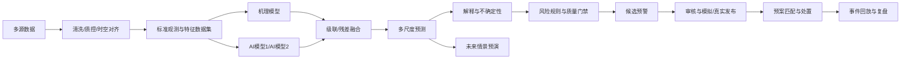
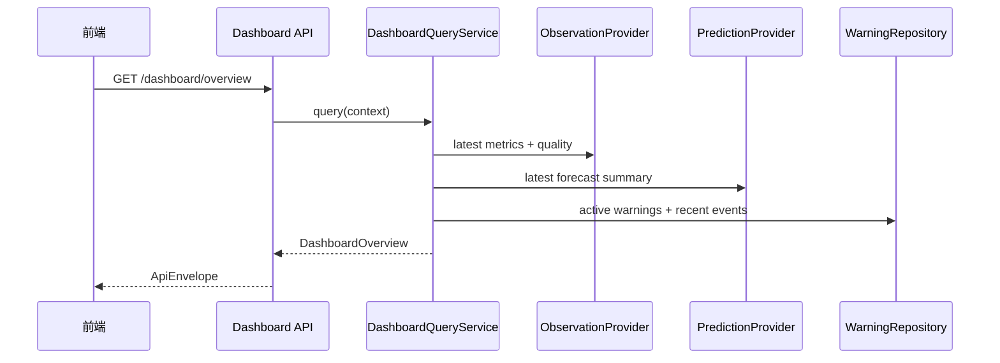
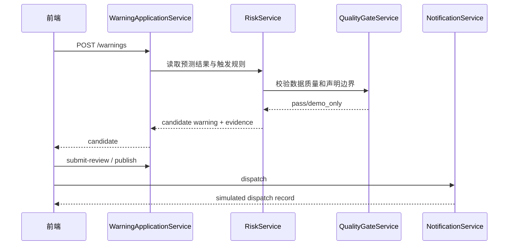

# A23 蓝藻水华监测预警系统：前后端联调与示例数据统一规范

> 本文件是前端、后端和示例数据之间的最终联调基准。前后端详细修改建议仍用于解释页面和后端架构，本文件负责消除命名、接口、状态和业务流程冲突。  
> 当前阶段使用明确标识的演示数据；未来接入清洗后的真实数据和成员 C 算法时，只替换 Provider，不修改页面、API 路径和核心响应结构。

---

## 1. 最终统一结论

当前不建设“全局场景系统”，不要求五个场景、`seed` 或模拟快照。

当前联调方式：

```text
静态演示数据文件
  → SimulatedObservationProvider
  → SimulatedPredictionProvider
  → 统一应用服务
  → /api/v1 接口
  → 前端页面
```

未来真实数据方式：

```text
清洗发布物 SQLite/Parquet/GeoTIFF
  → CleanedObservationProvider
  → MemberCModelProvider
  → 同一应用服务
  → 同一 /api/v1 接口
  → 前端页面无需重写
```

只发生以下变化：

| 项目 | 当前演示阶段 | 未来真实阶段 |
|---|---|---|
| 观测 Provider | `SimulatedObservationProvider` | `CleanedObservationProvider` |
| 预测 Provider | `SimulatedPredictionProvider` | `MemberCModelProvider` |
| `data_mode` | `simulated` | `observed` / `forecast` / `experimental` |
| 数据集版本 | `DEMO-OBS-V1` | 清洗任务真实版本 |
| 预测运行 | `DEMO-PRED-V1` | 算法服务真实运行 ID |
| 声明边界 | `simulation_only` | `historical_evidence_only` 或已批准模型声明 |
| 页面结构 | 保持不变 | 保持不变 |

---

## 2. 符合赛题的业务闭环



对应赛题能力：

- 多源感知：水质、气象、水文、遥感；
- 数据治理：清洗、异常、缺失、时空对齐、字段与单位统一；
- 机理与 AI：统一模型 Provider；
- 多尺度预测：1—3 天、7—15 天、30—90 天；
- 可解释性：驱动因素贡献；
- 不确定性：上下界和可信度；
- 数字孪生：站点、遥感图层、风险分区和时间轴；
- 四预：预报、预警、预演、预案；
- 历史回溯：数据、模型、预警和处置事件可追溯。

---

## 3. 前端页面、服务层和接口逐项匹配

| 前端页面/组件 | 前端 Service | 后端应用服务 | API | 当前示例数据 |
|---|---|---|---|---|
| 首页能力卡 | `systemService` | `CapabilityService` | `GET /system/capabilities` | 能力状态与声明边界 |
| 项目概览 | `datasetService` | `DatasetService` | `GET /datasets/summary` | 数据源、字段、时间范围 |
| 技术路线 | `pipelineService` | `PipelineService` | `GET /pipeline/runs/latest` | 当前演示运行状态 |
| 驾驶舱 KPI | `dashboardService` | `DashboardQueryService` | `GET /dashboard/overview` | 六分区风险、质量、事件摘要 |
| 站点/分区列表 | `spatialService` | `SpatialQueryService` | `GET /spatial-entities` | 6 个 `demo_zone` |
| 指标趋势 | `observationService` | `ObservationQueryService` | `GET /spatial-entities/{id}/observations` | 模拟水温、TP、TN、叶绿素等 |
| 数据质量卡 | `qualityService` | `QualityQueryService` | `GET /spatial-entities/{id}/quality` | 完整率、插补、异常数 |
| 预测趋势 | `forecastService` | `ForecastQueryService` | `GET /forecasts` | T+1/3/7/15/30/90 演示预测 |
| 驱动因素 | `forecastService` | `ExplainabilityService` | `GET /forecasts/{id}/explanations` | 演示规则贡献 |
| 风险热力图层 | `mapService` | `RiskMapService` | `GET /map/risk-polygons` | GeoJSON 演示风险面 |
| 图层目录 | `mapService` | `MapLayerService` | `GET /map/layers` | 站点/风险面/实验遥感 |
| 创建候选预警 | `warningService` | `WarningApplicationService` | `POST /warnings` | 生成 candidate |
| 提交审核 | `warningService` | `WarningApplicationService` | `POST /warnings/{id}/submit-review` | candidate → pending_review |
| 模拟发布 | `warningService` | `WarningApplicationService` | `POST /warnings/{id}/publish` | pending_review → published |
| 模拟发送 | `warningService` | `NotificationService` | `POST /warnings/{id}/dispatch` | 写模拟发送记录 |
| 确认/处置/关闭 | `warningService` | `WarningApplicationService` | acknowledge/actions/close | 完整状态机 |
| 推荐预案 | `planService` | `PlanMatchService` | `GET /warnings/{id}/recommended-plans` | 三类演示预案 |
| 历史事件 | `eventService` | `EventQueryService` | `GET /events` | 数据/模型/业务事件 |
| 事件回放 | `eventService` | `ReplayService` | `GET /events/{id}/replay` | 证据与状态时间线 |

API 表中的路径均自动加前缀 `/api/v1`。

---

## 4. 统一响应协议

网络传输层统一使用 `snake_case`。前端不要再手写另一套驼峰接口；使用 OpenAPI 生成类型。若组件内部希望使用驼峰，只能在 `apiAdapter` 内集中转换一次。

```ts
export interface ApiEnvelope<T> {
  data: T
  meta: {
    request_id: string
    generated_at: string
    data_mode: 'observed' | 'forecast' | 'experimental' | 'simulated'
    dataset_version_id?: string
    prediction_run_id?: string
    as_of?: string
    model_version?: string
    claim_boundary: string
    quality_status: 'good' | 'warning' | 'blocked'
  }
  errors: Array<{
    code: string
    message: string
    field?: string
  }>
}
```

当前所有示例接口固定返回：

```json
{
  "data_mode": "simulated",
  "dataset_version_id": "DEMO-OBS-V1",
  "prediction_run_id": "DEMO-PRED-V1",
  "as_of": "2026-08-24T08:00:00+08:00",
  "model_version": "demo-rule-v1",
  "claim_boundary": "simulation_only",
  "quality_status": "good"
}
```

页面全局数据条显示：

```text
演示数据 SIMULATED｜数据集 DEMO-OBS-V1｜基准 2026-08-24 08:00｜非决策用途
```

未来切换真实数据后，页面自动根据响应显示：

```text
真实公开数据 OBSERVED｜数据集 P12-04-...｜截至 2020-10-31｜部分数据已过期
```

---

## 5. 跨页面一致性约束

前端路由上下文统一保存：

```ts
interface AnalysisContext {
  data_mode: 'observed' | 'forecast' | 'experimental' | 'simulated'
  dataset_version_id: string
  prediction_run_id?: string
  spatial_entity_id?: string
  horizon_days?: 1 | 3 | 7 | 15 | 30 | 90
  as_of: string
}
```

URL 示例：

```text
/stations?data_mode=simulated&dataset_version_id=DEMO-OBS-V1&prediction_run_id=DEMO-PRED-V1&spatial_entity_id=DEMO-NW&horizon_days=7
```

一致性规则：

1. 驾驶舱、站点、热力图和事件页使用同一 `dataset_version_id`；
2. 预测、解释、风险图层和预警证据使用同一 `prediction_run_id`；
3. 切换时效只改变 `horizon_days`；
4. 切换站点只改变 `spatial_entity_id`；
5. 接口响应 ID 与当前上下文不一致时，前端丢弃响应并记录错误；
6. 页面刷新从 URL 恢复上下文；
7. 接口失败显示错误，不回退到另一份本地假数据。

---

## 6. 后端服务层调用顺序

### 6.1 驾驶舱查询



### 6.2 站点研判

```text
SpatialQueryService
  → ObservationQueryService（历史/演示观测）
  → QualityQueryService（新鲜度、缺失、插补、异常）
  → ForecastQueryService（预测运行和时效）
  → ExplainabilityService（与预测结果绑定）
```

不得由前端分别请求后自行拼出风险等级；风险等级由后端统一生成。

### 6.3 预警闭环



模拟数据允许走通业务流程，但：

- `simulated=true`；
- 不调用真实短信/邮件；
- 预警标题显示“演示预警”；
- 处置记录可真实持久化；
- 真实数据接入后仍需要质量门禁和人工审核。

---

## 7. Provider 设计：保证未来无痛替换

```python
class ObservationProvider(Protocol):
    def list_entities(self, query): ...
    def get_observations(self, spatial_entity_id, variables, start, end): ...
    def get_quality(self, spatial_entity_id): ...

class PredictionProvider(Protocol):
    def get_capabilities(self): ...
    def get_forecasts(self, prediction_run_id, spatial_entity_id, horizon_days): ...
    def get_explanations(self, forecast_id): ...
    def get_risk_layer(self, prediction_run_id, horizon_days): ...

class SimulatedObservationProvider(ObservationProvider):
    """读取 simulated_observations_v1.csv。"""

class SimulatedPredictionProvider(PredictionProvider):
    """读取 simulated_api_fixture_v1.json。"""

class CleanedObservationProvider(ObservationProvider):
    """未来读取 data_cleaning.db 和已发布 Parquet。"""

class MemberCModelProvider(PredictionProvider):
    """未来适配 blue_algae_m7 prediction contract。"""
```

Provider 选择只允许通过后端配置：

```text
OBSERVATION_PROVIDER=simulated|cleaned
PREDICTION_PROVIDER=simulated|member_c
```

前端不得通过按钮直接决定使用哪个后端 Provider。前端只读取响应中的 `data_mode`。

---

## 8. 核心接口请求与返回要求

### 8.1 驾驶舱

```http
GET /api/v1/dashboard/overview?dataset_version_id=DEMO-OBS-V1&prediction_run_id=DEMO-PRED-V1&horizon_days=7
```

返回：当前风险摘要、六分区排行、关键指标、数据质量、活动预警和最近事件。

### 8.2 观测时序

```http
GET /api/v1/spatial-entities/DEMO-NW/observations?dataset_version_id=DEMO-OBS-V1&variable_codes=water_temperature,total_phosphorus,total_nitrogen,chlorophyll_a,algae_density&start=2026-08-20T08:00:00%2B08:00&end=2026-08-24T08:00:00%2B08:00
```

返回的每个点包含：`observed_at`、`value`、`unit`、`quality_status`、`value_origin`、`is_imputed`。

### 8.3 预测

```http
GET /api/v1/forecasts?prediction_run_id=DEMO-PRED-V1&spatial_entity_id=DEMO-NW&horizon_days=7
```

返回预测指标、风险概率、风险等级、上下界、可信度和 `forecast_id`。

### 8.4 创建候选预警

```http
POST /api/v1/warnings
Content-Type: application/json

{
  "prediction_run_id": "DEMO-PRED-V1",
  "spatial_entity_id": "DEMO-NW",
  "horizon_days": 7,
  "rule_id": "DEMO-RULE-HIGH-V1"
}
```

后端必须从预测仓储读取证据，不能相信前端上传的风险分数。

### 8.5 模拟发送

```http
POST /api/v1/warnings/DEMO-WARN-001/dispatch

{
  "channels": ["demo_sms", "demo_email"],
  "recipient_group": "competition_demo_contacts"
}
```

返回 `dispatch_id`、`simulated=true`、发送模板和记录时间。

---

## 9. 示例数据说明

### 9.1 示例数据文件

```text
shenji-pan/sample-data/
├─ simulated_observations_v1.csv
└─ simulated_api_fixture_v1.json
```

用途：

- CSV：后端 `SimulatedObservationProvider` 或数据库初始化；
- JSON：能力、驾驶舱、预测、解释、风险图层、预警、事件和预案 fixture；
- MSW 可以读取 JSON；
- FastAPI 也可以在启动时加载同一份 JSON；
- E2E 测试固定使用这些 ID 和值。

### 9.2 六个演示空间对象

| ID | 名称 | 类型 | 用途 |
|---|---|---|---|
| `DEMO-NW` | 西北热点区 | `demo_zone` | 展示高风险形成与预警 |
| `DEMO-INLET` | 入湖河口区 | `demo_zone` | 展示营养盐输入影响 |
| `DEMO-SE` | 东南对照区 | `demo_zone` | 展示低风险对照 |
| `DEMO-CENTER` | 湖心观测区 | `demo_zone` | 展示湖心趋势 |
| `DEMO-INTAKE` | 取水口关注区 | `demo_zone` | 展示敏感目标与预案 |
| `DEMO-SOUTH` | 南部通道区 | `demo_zone` | 展示迁移通道 |

这些名称用于当前页面演示，不声明为真实监测站。未来获得真实站点映射和坐标后，替换为 `station/buoy/intake/river_section`。

### 9.3 示例指标

| 指标 | 字段 | 单位 | 当前示例用途 | 未来真实映射 |
|---|---|---|---|---|
| 水温 | `water_temperature` | ℃ | 演示值 | 真实水温字段；不能用气温无标识替代 |
| 气温 | `air_temperature` | ℃ | 驱动因子 | `direct_air_temperature` |
| 总磷 | `total_phosphorus` | mg/L | 演示值 | `direct_total_phosphorus` |
| 总氮 | `total_nitrogen` | mg/L | 演示值 | `direct_total_nitrogen` |
| 风速 | `wind_speed` | m/s | 演示值 | `direct_wind_speed` |
| 降水 | `precipitation` | mm/day | 演示值 | `direct_precipitation` |
| 叶绿素 a | `chlorophyll_a` | μg/L | 演示目标 | 未来正式观测/合格反演；现有反演仅 experimental |
| 藻密度 | `algae_density` | cells/L | 演示目标 | `direct_algae_density` |
| 风险概率 | `risk_probability` | 0—1 | 演示预测 | 成员 C 算法输出 |

### 9.4 示例数据之间的因果一致性

示例值遵循以下展示关系，但不声称科学标定：

- `DEMO-NW` 水温、TP、TN 和叶绿素较高，风速较低，T+7 风险最高；
- `DEMO-INLET` TP/TN 较高，用于展示入湖输入；
- `DEMO-SE` 指标较低，作为低风险对照；
- 预测时效越远，置信区间越宽；
- 演示驱动贡献方向与文案一致；
- 数据质量异常不会自动生成蓝藻业务预警；
- 所有演示预警证据指向同一 `DEMO-PRED-V1`。

---

## 10. 真实数据替换映射

### 10.1 观测数据

```text
simulated_observations_v1.csv
    ↓ 替换 Provider
data-cleaning/storage/data_cleaning.db.cleaned_observations
```

映射：

| API 字段 | 当前 CSV | 未来清洗字段 |
|---|---|---|
| `spatial_entity_id` | 演示分区 ID | `station_id` 经空间映射表转换 |
| `observed_at` | 示例时间 | `observed_at` |
| `variable_code` | 示例指标代码 | `variable_code` |
| `value` | `clean_value` | `clean_value` |
| `unit` | 示例单位 | `unit` |
| `value_origin` | `simulated_demo` | 真实 `value_origin` |
| `is_imputed` | 示例 false | `is_imputed` |
| `quality_status` | 示例 good | 从 `quality_flags` 解析 |

### 10.2 预测数据

```text
simulated_api_fixture_v1.json.forecasts
    ↓ 替换 Provider
member_c_modeling_framework prediction contract
```

成员 C 已有 `station_id`、`horizon_days`、metrics、`risk_probability`、`risk_level`、model_outputs、feature importance 和 uncertainty，可直接适配本规范。

### 10.3 长期预测

当前演示 fixture 可以展示 T+30/T+90，但必须标为 `simulated`。切换真实 Provider 后，如果 30—90 天数据仍为 `BLOCKED_AUTH`：

- `/forecast-capabilities` 返回不可用；
- 前端禁用 T+30/T+90；
- 显示缺少 C3S 季节预测回报数据；
- 禁止继续返回 fixture 冒充真实预测。

---

## 11. 前端建议目录

```text
src/
├─ api/generated/               # OpenAPI 生成代码
├─ adapters/apiAdapter.ts       # 可选 snake_case → camelCase
├─ services/
│  ├─ systemService.ts
│  ├─ dashboardService.ts
│  ├─ spatialService.ts
│  ├─ observationService.ts
│  ├─ forecastService.ts
│  ├─ mapService.ts
│  ├─ warningService.ts
│  ├─ planService.ts
│  └─ eventService.ts
├─ stores/analysisContext.ts
├─ domain/
├─ pages/
├─ components/
└─ mocks/
   ├─ handlers.ts
   └─ fixtureLoader.ts
```

页面不得直接调用 `fetch`，不得直接读取 fixture。开发 Mock 由 MSW 拦截，答辩运行调用真实 FastAPI。

---

## 12. 后端建议目录

```text
backend/app/
├─ api/v1/                      # 只做 HTTP 校验与响应
├─ application/                 # 用例服务
├─ domain/                      # 风险、预警、数据身份规则
├─ providers/
│  ├─ observations/
│  │  ├─ simulated.py
│  │  └─ cleaned.py
│  └─ predictions/
│     ├─ simulated.py
│     └─ member_c.py
├─ repositories/                # 数据库访问
├─ schemas/                     # Pydantic/OpenAPI
└─ workers/                     # 接入、预测、预警评估
```

Controller 不允许直接读取 CSV/SQLite，也不允许在路由函数内计算风险。

---

## 13. 实施顺序

### P0：完成当前假数据联调

1. 后端加载两份示例数据；
2. 实现 capabilities、dashboard、spatial、observations、quality；
3. 实现 forecasts、explanations、risk-polygons；
4. 前端移除 `script.js`/页面内硬编码对象；
5. 页面统一显示 `SIMULATED` 和非决策用途；
6. 四个核心页面使用同一数据集和预测运行 ID。

### P1：完成预警与预案闭环

1. 实现创建候选预警；
2. 实现审核、发布、模拟发送；
3. 实现确认、处置、关闭；
4. 实现推荐预案；
5. 历史页读取真实持久化事件。

### P2：替换真实清洗数据

1. 实现 `CleanedObservationProvider`；
2. 建站点/分区映射；
3. 接入数据集版本、质量和来源时间；
4. 同一套页面切换 `data_mode=observed`；
5. 实验遥感使用 `experimental`。

### P3：替换真实算法

1. 实现 `MemberCModelProvider`；
2. 接 1—3 天和 7—15 天；
3. 接解释性和不确定性；
4. 长期能力未就绪时保持阻塞；
5. 模型通过验收后才允许正式风险规则使用。

---

## 14. 最终联调验收

- [ ] 前后端字段统一为 OpenAPI `snake_case`；
- [ ] 页面、API、Provider、数据库字段映射一一对应；
- [ ] 当前数据统一使用 `DEMO-OBS-V1`；
- [ ] 当前预测统一使用 `DEMO-PRED-V1`；
- [ ] 所有演示响应是 `data_mode=simulated`；
- [ ] 所有演示结果是 `claim_boundary=simulation_only`；
- [ ] 六个演示对象均为 `demo_zone`；
- [ ] 预测、解释、热力和预警证据使用同一预测运行；
- [ ] 接口失败不回退另一份本地假数据；
- [ ] 数据质量告警不会触发蓝藻预警；
- [ ] 模拟发送不会调用真实外部服务；
- [ ] 真实数据替换只修改 Provider 配置；
- [ ] 真实算法替换不修改前端 API；
- [ ] 30—90 天真实能力未就绪时禁用且说明原因；
- [ ] 完成驾驶舱 → 站点 → 热力 → 预警 → 处置 → 历史回放全流程。
