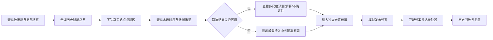
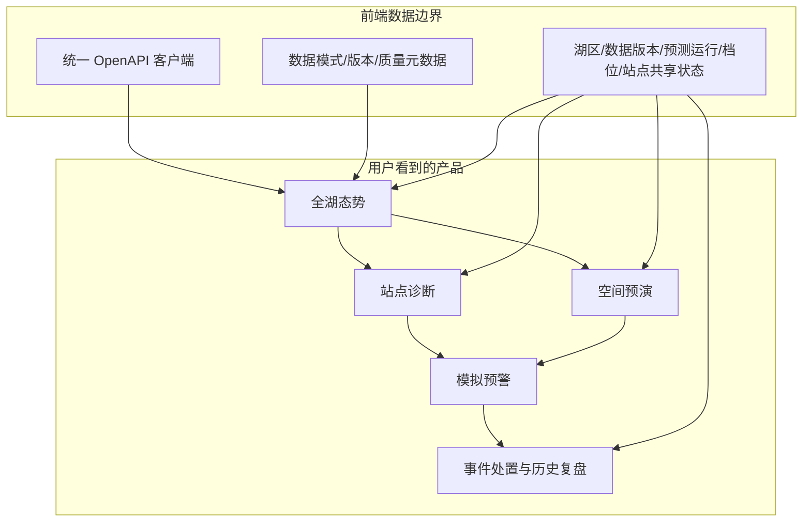

# A23 蓝藻水华监测预警系统：前端完整修改建议（无真实算法数据阶段）

> 适用阶段：算法仍在开发、暂无可用于正式展示的实时预测结果。  
> 目标：当前统一使用一份字段与未来真实数据一致、身份清楚的演示数据完成联调；后续通过 Provider 替换为真实清洗数据和成员 C 算法结果，页面与 API 不重写。  
> 本文只讨论前端与用户体验，不评价和设计具体算法。

> **联调基准**：接口字段、服务层、示例 ID 和替换流程以《前后端联调与示例数据统一规范》为准；当前示例数据位于 `shenji-pan/sample-data/`。

## 1. 结论先行

当前项目已经具备较好的视觉门面、Vue 3 页面基础、Leaflet 地图、ECharts 图表和跨页时间档位联动。下一步不建议继续增加纯装饰性页面，也不建议现在迁移 React 或直接全面重做 3D。最有价值的改进方向是：

1. 把“静态大屏”升级为能完成监测、预测、预警、处置和复盘的联调产品；
2. 删除生产环境的静默 Mock 回退，真实、实验、预测和演示数据分别标识；
3. 当前所有页面统一使用 `DEMO-OBS-V1` 和 `DEMO-PRED-V1`，未来替换为真实数据集版本与预测运行；
4. 优先做好地图下钻、数据质量、预警闭环、历史回放和移动端答辩体验；
5. 保留 Leaflet 作为近期主地图，若评审确实要求 3D，再按需引入 Cesium。

预期效果：评委可以在 3—5 分钟内走通“查看真实数据与质量 → 识别当前能力边界 → 查看算法输出或接入状态 → 进入未来预演 → 模拟发布预警 → 查看处置记录”，并能分清哪些是真实历史数据、实验数据、算法结果和演示数据。

## 2. 改造后的产品主线



这条主线对应赛题要求的多源数据融合、质量管控、多时间尺度预测、可解释性、不确定性、数字孪生、历史回溯、未来情景预演和预案管理。未来预演只是其中一个业务环节，不是全局数据入口。

## 3. 数据展示的首要原则：真实优先、身份清楚

### 3.1 页面必须展示数据身份

全局导航右侧只展示当前数据身份和版本，不展示虚构场景、seed 或快照编号。当前联调阶段示例：

```text
演示数据 SIMULATED | 数据集 DEMO-OBS-V1 | 基准 2026-08-24 08:00 | 非决策用途
```

每张指标卡或预测卡显示与自身相关的字段：

- 数据类型：真实观测 / 再分析数据 / 实验反演 / 算法预测 / 演示预演；
- 观测时间或预测基准时刻；
- 数据来源与数据集版本；
- 数据新鲜度、质量标记、是否插补或代理；
- 预测卡显示模型版本、预测时效和预测运行 ID；
- 置信区间是算法计算值、实验估计值还是演示值。

严禁接口失败时静默回退另一份本地 Mock。当前后端主动返回 `data_mode: "simulated"`；未来切换真实 Provider 后返回 `observed/forecast/experimental`。前端只相信响应身份，不自行切换 Provider。

### 3.2 赛题中的“场景/预演”到底指什么

赛题原文要求的是：

- 数字孪生场景下的实时推演与决策支持；
- 历史场景回溯；
- 未来情景预演；
- 应急预案管理。

它没有要求系统全局提供“五套模拟场景”，也没有要求用户看到 `seed` 或模拟快照编号。因此本项目规划调整为：

1. **当前驾驶舱、监测站、热力和历史页面读取同一份 `DEMO-OBS-V1`**；
2. **当前预测读取 `DEMO-PRED-V1`**，始终标记为演示；未来切换成员 C 算法输出；
3. **未来预演是独立功能**，允许用户基于某次预测设置“温度升高、风速变化、降雨变化”等假设；
4. 预演结果显示“演示预演”，不得写回真实观测，也不触发真实通知；
5. “传感器异常”属于数据质量测试或故障演练，不属于蓝藻业务场景列表。

答辩确需稳定演示时，可以保存一套预演案例作为备用，但它不是赛题强制要求，不进入全局导航，也不要求准备五套。

## 4. 信息架构调整

### 4.1 保留现有页面，但重新定义职责

| 现有页面 | 建议定位 | 核心任务 |
|---|---|---|
| 首页 | logo | 介绍
| 驾驶舱 | 全湖态势首页 | 3 秒内识别最高风险、变化方向和数据状态 |
| 监测站 | 单点诊断页 | 观测、预测、驱动因素、数据质量 |
| 风险热力 | 空间研判页 | 未来时段扩散、热区迁移、置信区间 |
| 历史事件 | 复盘与处置页 | 事件时间线、处置记录、预案匹配 |

当前设计资料中的 P02—P09 可以作为后续专业模块储备，但不建议现在把 9 个模块全部做成同等深度。比赛演示应先把“驾驶舱、站点、热力、历史处置”四个核心任务做深。

### 4.2 全局布局

```text
┌──────────────────────────────────────────────────────────────┐
│ 品牌 / 湖区选择 / 数据来源 / 数据更新时间 / 服务状态 / 用户 │
├──────────────────────────────────────────────────────────────┤
│ 当前数据：历史监测概览              │ 预测：模型接入中          │
├────────────────────────────┬─────────────────────────────────┤
│                            │ 风险摘要                        │
│        湖区主地图          │ - 影响范围                      │
│   站点 / 热区 / 扩散轨迹   │ - 主要驱动                      │
│                            │ - 数据质量                      │
│                            │ - 建议动作                      │
├────────────────────────────┴─────────────────────────────────┤
│ 时间播放轴 T+1 T+3 T+7 T+15 T+30 T+90 / 播放 / 倍速       │
└──────────────────────────────────────────────────────────────┘
```

## 5. 分页面修改建议

### 5.1 首页

#### 修改方向

- 保留当前大标题和湖区视觉；
- 首屏减少解释性长文本，增加一句可验证价值：“提前展示未来 1—90 天风险变化，支持站点下钻、空间预演与预案匹配”；
- “进入驾驶舱”作为唯一主按钮，“查看项目方案”作为次按钮；
- 右侧湖区图由装饰图升级为可点击的六站点缩略态势；
- 增加清晰入口：“查看真实数据概览”和“查看未来预演”；
- 所有数字注明真实来源、时间和质量；仅预演结果标“演示预演”。

#### 达成效果

评委首屏能同时理解项目做什么、现在看到的数据是什么、下一步点哪里，而不是只感受到科技风格。

### 5.2 驾驶舱总览

#### 修改方向

当前驾驶舱更像三个子页面的入口，应升级为真正的全湖态势页：

1. 第一行：数据时间范围、可用站点、数据质量、预测服务状态；算法结果可用后再显示最高预测风险；
2. 中央：湖区地图，支持站点、风险面、扩散轨迹三层开关；
3. 右侧：风险摘要、驱动因素、数据质量和推荐动作；
4. 底部：全局时间轴与最近事件；
5. 点击风险点进入站点页，点击热区进入空间研判；
6. 提供“恢复默认筛选”按钮；只有进入独立预演模块后才提供“重置预演”。

#### 达成效果

从目录页变为业务首页，形成“一屏总览、点击下钻、时间联动”的指挥舱体验。

### 5.3 监测站研判

#### 修改方向

- 左侧地图与右侧站点诊断固定联动；
- 增加观测/预测分界线：真实历史观测使用实线，正式算法预测使用虚线和区间带；
- 指标统一显示单位、正常范围、同比/环比和质量状态；
- 算法未完成时模型区显示“算法接入中”和阻塞原因，不绘制虚构模型对比；
- SHAP/驱动贡献只在算法服务返回真实解释结果后展示；样例接口结果必须标 `sample_interface_only`；
- 增加数据质量卡：完整率、最后更新时间、异常点、插补比例；
- 站点切换时取消上一个网络请求，避免旧结果覆盖新站点；
- 地图旁增加可键盘操作的站点列表。

#### 达成效果

用户可以分清事实、预测、解释和数据质量，不会把样例解释或接口占位结果当成真实算法结论。

### 5.4 风险热力与未来预演

#### 修改方向

- 当前 19×11 矩形格网应叠加到真实湖体地图，而不是与地图割裂；
- 同时支持热力层、分级面、等值线三种表现，默认使用分级面，避免颜色过度平滑造成虚假精度；
- 时间轴增加 T+90，符合赛题 30—90 天长期预测要求；
- 播放时突出“热区中心迁移、影响面积、最高风险、置信度变化”；
- 显示图层身份、空间分辨率和方法，例如“实验遥感反演 / 算法预测 / 演示预演”；
- 提供当前帧与基准帧对比；
- 导出当前研判画面的功能可放 P2，不作为首要开发任务。

#### 达成效果

让未来预演真正体现“时空变化”，而不是五个档位切换同一张图。

### 5.5 历史事件与预警处置

#### 修改方向

- 把“立即推送（短信+邮件）”改为“模拟发送预警”；
- 发送前展示预警对象、渠道、模板和数据模式；
- 发送后生成不可变处置记录，而非只显示一个成功提示；
- 事件详情增加：触发规则、影响范围、关联站点、数据集版本、预测运行和建议预案；
- 预案至少准备 3 套：取水口保护、重点湖湾巡查、强降雨后加密监测；
- 支持“事件前 24h—事件后 48h”回放；
- 日期筛选应有校验、空状态和错误提示。

#### 达成效果

把预警从按钮动画升级为业务闭环，可直接对应赛题的预警发布与应急预案管理。

## 6. 地图与 2D/3D 技术路线

### 6.1 近期建议：Leaflet + 可视化图层

当前六站点、209 个风险格网和少量轨迹不需要立即更换地图框架。建议继续使用 Leaflet，并补齐：

- GeoJSON 湖体边界；
- 站点聚合和标签避让；
- 风险 Polygon/GeoJSON 图层；
- 时间播放层；
- 图层控制、图例、数据来源；
- 地图离线/瓦片失败状态；
- 数据内容安全编码。

若网格规模扩大到数万点或需要粒子流场，可以评估 deck.gl。其优势是 GPU 驱动的大规模地理图层、拾取、高亮和过滤能力。

### 6.2 中期建议：按需接入 Cesium

赛题要求二/三维，不等于必须立刻全面 3D。可在 P2 增加“2D/3D”切换：

- 2D 默认用于日常研判；
- 3D 用于答辩演示湖面、站点、风险柱、扩散轨迹；
- 2D/3D 使用同一份 GeoJSON/CZML、数据集版本和预测运行接口；
- 低性能设备自动回落 2D。

TerriaJS 的做法值得参考：Cesium 提供 3D，无法运行时回落 Leaflet，并支持时间维度和多种地理数据格式。不要直接复制其完整产品架构，只借鉴 2D/3D 降级、图层目录和可分享地图状态。

## 7. 前端数据层重构

### 7.1 建议目录

```text
src/
├─ api/                 # OpenAPI 生成的客户端
├─ domain/              # Station、Observation、Forecast、Warning 类型
├─ providers/
│  ├─ apiProvider.ts    # 调统一后端，按响应区分数据身份
│  └─ demoProvider.ts   # 仅开发/自动化测试使用
├─ mocks/
│  ├─ handlers.ts       # MSW 网络级 Mock
│  └─ fixtures/         # 边界和异常场景
├─ stores/              # Pinia 或明确的组合式状态
├─ components/
│  ├─ map/
│  ├─ charts/
│  ├─ warning/
│  └─ common/
└─ pages/
```

### 7.2 统一返回元数据

```ts
interface ApiEnvelope<T> {
  data: T
  meta: {
    request_id: string
    generated_at: string
    data_mode: 'observed' | 'forecast' | 'experimental' | 'simulated'
    dataset_version_id?: string
    prediction_run_id?: string
    as_of?: string
    model_version?: string
    claim_boundary: string
    quality_status: 'good' | 'warning' | 'blocked'
  }
  errors: Array<{ code: string; message: string; field?: string }>
}
```

前端任何页面都只接受带 `meta` 的数据，禁止丢失数据模式。

### 7.3 Mock 的正确使用方式

- 开发和测试：使用 MSW，在网络层模拟相同接口、错误码、延迟和异常；
- 答辩演示：默认调用 FastAPI 的真实历史数据接口；仅主动进入未来预演时调用演示数据接口；
- 生产模式：接口失败显示错误，不回退未标识本地数据；
- 所有响应遵循同一 OpenAPI schema。

MSW 的价值是让页面的真实请求代码不需要知道自己是否被拦截，且同一套 handlers 可用于开发、集成测试和 E2E。

## 8. 视觉系统与组件规范

### 8.1 统一设计 Token

合并 `tokens.css` 与 `src/styles.css` 的重复语义，保留一套：

```css
--color-risk-high;
--color-risk-medium;
--color-risk-low;
--color-data-simulated;
--color-data-real;
--surface-page;
--surface-panel;
--text-primary;
--text-secondary;
--spacing-1 ... --spacing-8;
```

### 8.2 必须补齐的状态组件

- `DataModeBadge`：真实观测/算法预测/实验反演/演示预演；
- `DataFreshness`：更新时间和延迟；
- `QualityBadge`：正常/关注/阻断；
- `LoadingSkeleton`；
- `EmptyState`；
- `ErrorState + Retry`；
- `DataSourceSelector`；
- `DataProvenanceDrawer`；
- `WarningActionDialog`；
- `MapLegend`；
- `MetricValue`：值、单位、范围、趋势、质量状态统一渲染。

## 9. 性能、兼容性、安全与无障碍

### 9.1 性能

- 所有页面改为路由懒加载；
- ECharts、Leaflet、未来 Cesium 独立 Chunk；
- 地图进入视口后再初始化；
- 对时间轴播放只更新图层数据，不重建整个地图；
- API 增加超时、取消、重试策略；
- 建立构建门禁：主入口 gzip 建议不超过 150KB，地图和图表按需加载。

### 9.2 安全

- Leaflet `divIcon` 不拼接未经编码的站点名称，使用 DOM `textContent`；
- 升级存在安全公告的 ECharts；
- 配置 CSP；
- 前端不保存真实密钥；
- 预警发送必须经过后端鉴权，前端按钮不能代表权限。

### 9.3 无障碍和移动端

- 所有触摸目标至少 44×44px；
- 地图旁提供站点列表作为等价操作入口；
- 开启地图键盘操作；
- 风险不只依赖颜色，增加文字、图标和纹理；
- 图表提供摘要和可下载表格；
- 支持 `prefers-reduced-motion`；
- 移除浏览器后退键 sentinel，保持原生导航语义；
- 增加 404 和全局错误边界。

## 10. 工程质量与测试

建议新增：

- TypeScript；
- `vue-tsc --noEmit`；
- ESLint + Prettier；
- Vitest + Vue Test Utils；
- Playwright；
- axe-core 可访问性检查；
- OpenAPI 客户端自动生成；
- bundle size 检查。

关键 E2E 场景：

1. 切换真实历史数据集版本后，站点、地图、KPI 和质量信息一致；
2. 算法结果可用时切换 T+7，地图热区、站点预测和标题同步；不可用时显示能力阻塞；
3. 快速切换站点不会出现旧请求覆盖；
4. 后端 500 时显示错误，不出现无标识 Mock；
5. 模拟发送预警生成处置记录；
6. 390px 移动端可完成全部主流程；
7. 键盘可选择站点和档位。

## 11. 分阶段实施建议

### P0：先形成可信数据展示闭环（3—5 天）

- 全局数据身份、来源时间和质量状态；
- 数据集版本与预测运行元数据；
- 移除生产环境静默 Mock；
- 驾驶舱升级为全湖态势；
- 预警按钮改为模拟预警并生成处置记录；
- T+90 档位；
- 修复地图 XSS；
- 补齐加载、错误、空状态。

### P1：提高答辩表现和工程质量（5—8 天）

- 热力图叠加真实湖体地图；
- 事件完整回放；
- 数据质量卡和置信区间；
- TypeScript、OpenAPI 客户端、MSW；
- 路由拆包和移动端；
- 核心 E2E 测试。

### P2：增强数字孪生表现（视时间安排）

- 2D/3D 切换；
- Cesium 风险柱、扩散轨迹和相机漫游；
- 当前研判画面导出；
- 多湖区切换；
- 数据管线运行状态或算法任务状态更新；比赛阶段轮询即可，暂不强制 WebSocket。

## 12. 验收标准

- 页面始终明确显示数据模式，不能把模拟数据称为真实预测；
- 同一数据集版本或预测运行的站点、地图、趋势、解释和事件保持一致；
- 1—3 天和 7—15 天按实际能力展示；30—90 天未就绪时明确阻塞；
- 未来预演与真实观测完全隔离并明确标识；
- 完成一次模拟预警后可在历史事件中看到处置记录；
- 后端断开时页面显示错误态，不显示无标识数据；
- 桌面、平板和 390px 手机宽度均无主页面横向滚动；
- 键盘可以完成站点选择、时间切换和预警确认；
- 首屏核心风险信息在 3 秒内可理解。

## 13. 参考项目与借鉴点

| 项目 | 链接 | 建议借鉴 | 不建议照搬 |
|---|---|---|---|
| EPA How’s My Waterway | https://github.com/USEPA/mywaterway | 响应式、地图为中心、从总体到区域/社区下钻 | 其美国数据源和页面内容 |
| TerriaJS | https://github.com/TerriaJS/terriajs | 2D/3D 降级、时间维度、多图层目录、地图状态分享 | 完整平台体量和技术栈 |
| CesiumJS | https://github.com/CesiumGS/cesium | 动态时空数据、3D 地球/地图、开放格式 | 现在立即全面替换 Leaflet |
| deck.gl | https://github.com/visgl/deck.gl | 大规模 GPU 地理图层、拾取、高亮、过滤 | 当前小规模站点中过早引入 |
| Grafana | https://github.com/grafana/grafana | 时间范围、变量筛选、下钻、告警和多数据源标识 | 直接嵌入整套 Grafana UI |
| ThingsBoard | https://github.com/thingsboard/thingsboard | 遥测、告警规则、通知、设备/资产关系和多状态大屏 | 为比赛原型引入完整 IoT 平台 |
| MSW | https://github.com/mswjs/msw | 网络级 API Mock，复用开发、测试和 E2E handlers | 作为答辩时唯一后端 |

## 14. 全局页面骨架与响应式规则

### 14.1 桌面端页面骨架

所有业务页面采用同一个 `AppShell`，禁止每个页面自行决定顶部、返回和内容宽度。

```text
┌──────────────────────────────────────────────────────────────────────┐
│ GlobalNav：品牌｜全局导航｜湖区｜数据来源｜更新时间｜服务状态｜用户 │ 64px
├──────────────────────────────────────────────────────────────────────┤
│ ContextBar：面包屑｜数据集版本/预测运行｜质量状态｜查看来源详情      │ 40px
├──────────────────────────────────────────────────────────────────────┤
│ PageHeader：返回父级｜页面标题/说明｜主要状态｜页面操作              │ 96—144px
├──────────────────────────────────────────────────────────────────────┤
│                                                                      │
│ PageContent：最大宽度 1600px，左右安全边距 24—32px                  │
│                                                                      │
├──────────────────────────────────────────────────────────────────────┤
│ 可选 StickyTimeDock：全局时间档位/播放/倍速/当前时间                │ 64—84px
└──────────────────────────────────────────────────────────────────────┘
```

规则：

- `GlobalNav` 全站保留，桌面端吸顶；
- `ContextBar` 仅驾驶舱及三个业务子页显示；
- 一级页面不显示返回按钮，驾驶舱子页统一返回驾驶舱；
- 页面标题和返回入口必须处于首屏，不把返回按钮放到长页面最底部作为唯一入口；
- 时间轴只保留一个主实例，避免页面顶部和底部出现两套不同状态；
- 地图页可使用底部吸附时间轴，文本介绍页不使用；
- 内容最大宽度统一，禁止 Home、Stations、Heatmap 各自使用互相冲突的宽度。

### 14.2 平板和移动端骨架

```text
┌──────────────────────────────┐
│ 品牌  数据模式      主题 菜单 │ 56px
├──────────────────────────────┤
│ ← 返回父级   页面标题         │ 48—64px
├──────────────────────────────┤
│ 数据来源/档位/更新时间摘要    │ 可横向滚动但页面本身不横滚
├──────────────────────────────┤
│                              │
│ 单列内容区                    │
│ 地图 → 关键状态 → 详情 → 图表 │
│                              │
├──────────────────────────────┤
│ 返回驾驶舱｜时间轴｜更多       │ safe-area 底部栏
└──────────────────────────────┘
```

移动端规则：

- 小于 760px 后全部业务主体变为单列；
- 地图优先于侧栏，地图高度建议 360—460px，不使用 620px 固定最小高度；
- KPI 卡使用 2×2，而不是六张横向排列；
- 顶部只保留品牌、数据模式和菜单，完整导航进入抽屉；
- 底部操作栏仅放三个高频动作，不堆叠全部导航；
- 底部栏增加 `padding-bottom: env(safe-area-inset-bottom)`；
- 触摸目标至少 44×44px；
- 图表默认显示摘要，用户点击“展开图表”后再显示完整坐标轴。

### 14.3 推荐断点

| 断点 | 页面行为 |
|---|---|
| ≥1440px | 三栏驾驶舱、完整导航、地图和双侧栏 |
| 1180—1439px | 双栏布局，右侧分析栏下移 |
| 760—1179px | 地图 + 下方卡片，导航精简 |
| 480—759px | 单列、2×2 KPI、底部操作栏 |
| <480px | 缩短标题和标签，图表摘要优先 |

## 15. 分页面详细布局蓝图

## 15.1 首页 `/`

### 桌面端布局

```text
┌────────────────────────────────────────────────────────────────────┐
│ GlobalNav：A23 / 项目概览 / 技术路线 / 驾驶舱    SIMULATED 主题   │
├──────────────────────────────┬─────────────────────────────────────┤
│ HERO 55%                     │ 湖区数据缩略态势 45%                │
│ 机理 × AI 融合               │ 历史站点 + 实验遥感 + 数据质量     │
│ 蓝藻水华监测预警             │ 当前能力与更新时间                 │
│ 一句话价值                   │ 数据：演示数据 DEMO-OBS-V1         │
│ [查看真实数据] [了解项目]    │ [进入全湖态势]                     │
│ 多源数据 / 质量管控 / 多尺度 │                                     │
├──────────────────────────────┴─────────────────────────────────────┤
│ 三步能力：多源治理 → 多尺度预测接口 → 预警处置闭环                │
├────────────────────────────────────────────────────────────────────┤
│ 当前能力卡：真实历史监测 / 实验遥感 / 算法接入状态 / 未来预演     │
└────────────────────────────────────────────────────────────────────┘
```

### 组件顺序

1. `GlobalNav`；
2. `HomeHero`；
3. `LakeMiniOverview`；
4. `CapabilitySteps`；
5. `CapabilitySummary`；
6. 项目边界与数据声明；
7. 页脚。

### 移动端

- 标题 → 数据能力说明 → 查看真实数据按钮 → 湖区缩略图 → 三项能力；
- 主按钮通栏，次按钮文字链接化；
- 不在首屏堆叠演示案例，优先显示当前数据身份、质量和算法能力；
- 首页不设置“返回”按钮，Logo 点击返回首页。


## 15.4 驾驶舱 `/cockpit`

驾驶舱应从入口目录升级为实际全湖态势首页。

### 桌面端布局（≥1440px）

```text
┌────────────────────────────────────────────────────────────────────┐
│ ContextBar：太湖｜SIMULATED｜DEMO-OBS-V1｜08:00｜非决策用途        │
├────────────────────────────────────────────────────────────────────┤
│ 全湖态势          历史监测与数据质量              [默认筛选][详情] │
├──────────────┬────────────────────────────────────┬────────────────┤
│ 左侧 22%     │ 中央地图 56%                       │ 右侧 22%      │
│ 站点数据覆盖 │ 站点 / 遥感 / 质量 / 预测图层      │ 当前数据摘要  │
│ 数据质量     │ 点击点位联动左右信息                │ 主要驱动      │
│ 最近告警     │                                    │ 建议动作      │
├──────────────┴────────────────────────────────────┴────────────────┤
│ 预测可用后：T+1 T+3 T+7 T+15；30—90天未就绪时禁用并说明原因      │
├──────────────────────┬──────────────────────┬──────────────────────┤
│ 进入站点诊断         │ 进入风险预演         │ 进入事件复盘         │
└──────────────────────┴──────────────────────┴──────────────────────┘
```

### 平板布局

```text
地图（通栏）
→ 4张 KPI
→ 风险排行 + 当前研判（双栏）
→ 最近告警
→ 时间轴
```

### 移动端布局

```text
页面标题 + 数据身份
→ 当前数据范围/预测状态大卡
→ 地图
→ 可用时效选择/能力阻塞提示
→ 当前研判/建议动作
→ 站点数据覆盖/风险列表
→ 最近事件
→ 底部：站点｜预演｜事件
```

### 关键交互

- 点击地图点位后只更新当前选择，不自动跳页；
- 二次点击点位或点击“查看站点详情”才进入站点页；
- 风险排行与地图点位双向高亮；
- `默认筛选` 恢复默认时间范围、数据来源和站点；
- 切换数据集版本或预测运行时显示加载状态，并在完成后更新数据来源信息。

## 15.5 监测站 `/stations`

### 桌面端布局

```text
┌────────────────────────────────────────────────────────────────────┐
│ ← 返回驾驶舱  监测站点研判  DEMO-NW  演示分区  SIMULATED           │
│ 面包屑：驾驶舱 / 监测站 / DEMO-NW                  [进入预警研判]   │
├────────────────────────────────────────────────────────────────────┤
│ 站点选择器｜数据来源｜时间范围/预测档位｜更新时间｜质量状态        │
├───────────────────────────────┬────────────────────────────────────┤
│ 地图 55%                      │ 站点摘要 45%                       │
│ 六站点、选中态、风险热区      │ 风险、位置、数据质量、建议动作     │
├───────────────────────────────┴────────────────────────────────────┤
│ 指标卡：叶绿素a｜藻密度｜总磷｜水温｜风速｜更新时间               │
├─────────────────────────────────────┬──────────────────────────────┤
│ 主趋势图 65%                        │ 预测能力/预测摘要 35%         │
│ 历史观测实线 / 正式预测虚线         │ 模型未就绪时显示接入状态      │
├─────────────────────────────────────┼──────────────────────────────┤
│ 算法驱动贡献/接入状态               │ 数据质量                     │
│ 因子排行 + 响应曲线                 │ 缺失、异常、插补、新鲜度     │
├─────────────────────────────────────┴──────────────────────────────┤
│ 站点事件时间线                                                     │
└────────────────────────────────────────────────────────────────────┘
```

### 页面内 Tab

只保留三个：

1. `趋势与预测`；
2. `驱动因素`；
3. `数据质量`。

“SHAP解释”仅在正式算法结果可用时展示；未完成时显示算法接入状态、可用训练集和阻塞原因。

### 移动端

- 返回驾驶舱置于标题栏左侧；
- 站点选择器用底部抽屉，不在地图上堆六个难点的小标签；
- 地图 → 核心指标 → 趋势图 → Tab → 事件时间线；
- 页面底部操作栏：`返回驾驶舱`、`切换站点`、`模拟预警`；
- “模拟预警”是危险操作样式，但必须先进入确认弹窗。

## 15.6 风险热力 `/heatmap`

### 桌面端布局

```text
┌────────────────────────────────────────────────────────────────────┐
│ ← 返回驾驶舱  风险热力与未来预演  图层身份/预测运行清晰可见        │
├────────────────────────────────────────────────────────────────────┤
│ KPI：覆盖范围｜有效像元｜风险面积｜最高风险｜不确定性/质量         │
├──────────────┬──────────────────────────────────────┬──────────────┤
│ 左栏 20%     │ 地图 60%                             │ 右栏 20%    │
│ 图层开关     │ 湖体 + 风险面 + 热点 + 迁移轨迹      │ 热点排行    │
│ 阈值/图例    │ 当前帧/基准帧切换                    │ 影响站点    │
│ 空间分辨率   │                                      │ 风险摘要    │
├──────────────┴──────────────────────────────────────┴──────────────┤
│ 时间轴：T+1 T+3 T+7 T+15 T+30 T+90｜播放｜倍速｜回到基准          │
├────────────────────────────────┬───────────────────────────────────┤
│ 风险面积随时间变化             │ 热点中心迁移/置信区间            │
└────────────────────────────────┴───────────────────────────────────┘
```

### 移动端

- 标题 → 4个核心 KPI → 地图 → 时间轴 → 当前帧摘要 → 热点排行；
- 图层控制放入 `MapLayerDrawer`，不悬浮六个按钮遮挡地图；
- 图例折叠为单行，点击展开详细阈值；
- 返回驾驶舱和播放/暂停位于底部栏；
- 在小屏不同时显示两张复杂图，只显示当前摘要和一个趋势图。

## 15.7 历史事件 `/history`

### 桌面端布局

```text
┌────────────────────────────────────────────────────────────────────┐
│ ← 返回驾驶舱  历史事件与处置复盘            [导出演示记录 P2]      │
├────────────────────────────────────────────────────────────────────┤
│ 日期范围｜事件类型｜站点/分区｜数据模式｜处置状态｜[查询] [重置]   │
├───────────────────────────────┬────────────────────────────────────┤
│ 事件列表 38%                  │ 事件详情 62%                       │
│ 日期分组                      │ 标题、风险、时间、证据版本         │
│ 风险/状态/站点                │ 指标趋势、因果链、影响范围         │
│ 支持分页或虚拟列表            │ 模拟发送记录、处置时间线           │
│                               │ 推荐预案、确认/关闭操作            │
├───────────────────────────────┴────────────────────────────────────┤
│ 历史播放轴：事件前24h ← 事件时刻 → 事件后48h                      │
└────────────────────────────────────────────────────────────────────┘
```

### 移动端

- 默认显示事件列表；
- 点击事件后进入独立详情视图或全屏抽屉；
- 详情标题栏明确提供 `← 返回事件列表`，不要直接返回驾驶舱；
- 详情底部操作栏：`返回列表`、`匹配预案`、`模拟发送/关闭`；
- 筛选器放入底部抽屉，顶部只显示日期和筛选数量；
- 没有选中事件时显示指导型空状态。

## 15.8 404 与错误恢复页面

新增 catch-all 路由：

```text
页面未找到
你访问的页面不存在或链接已失效。
[返回上一业务页面] [回到首页] [进入驾驶舱]
```

`返回上一业务页面` 只在确认存在站内来源时显示；否则默认进入驾驶舱，避免再次依赖会被劫持的浏览器历史逻辑。

## 16. 小组件布局与交互规范

## 16.1 返回按钮 `BackLink`

### 使用规则

- 使用确定性路由，例如站点、热力、历史统一返回 `/cockpit`；
- 历史事件详情返回事件列表，而不是直接跳驾驶舱；
- 不使用 `history.back()` 作为唯一实现，因为从外部链接进入时目标不可控；
- 一级页面不显示返回按钮；
- Logo 永远返回首页；
- 页面底部可以重复提供返回入口，但不能替代顶部入口。

### 桌面样式

```text
← 返回驾驶舱   监测站点研判
```

- 位于 `PageHeader` 左上，与标题基线对齐；
- 图标和文字共同构成至少 44px 高的点击区域；
- 默认次级颜色，hover 后使用强调色；
- 保留明显 `focus-visible` 外框；
- 不使用只有“←”没有文本的桌面按钮。

### 移动样式

- 标题栏左侧使用“← 返回”或“← 驾驶舱”；
- 不把返回按钮挤入右上角菜单；
- 详情抽屉使用“关闭”与“返回列表”区分，避免 `×` 语义不清；
- iOS/全面屏底部栏遵循 safe area。

推荐组件接口：

```vue
<BackLink
  to="/cockpit"
  label="返回驾驶舱"
  fallback-to="/"
/>
```

## 16.2 面包屑 `Breadcrumbs`

- 仅桌面和平板展示完整面包屑；
- 移动端只显示父级返回，不显示过长路径；
- 当前页面使用纯文本，不做可点击链接；
- 示例：`驾驶舱 / 监测站 / NW-01 西北热点区`；
- 站点名称过长时截断，但保留 title/可访问名称。

## 16.3 数据模式条 `DataContextBar`

布局：

```text
太湖｜SIMULATED｜DEMO-OBS-V1｜基准 08:00｜非决策用途｜查看来源
```

- 桌面端位于全局导航下方；
- 移动端当前压缩为 `演示数据 · DEMO-OBS-V1 · 08:00`；未来真实数据按来源时间和新鲜度显示；
- 真实、实验、预测、预演使用不同标签，均不与风险等级颜色混用；
- 数据过期时变为琥珀色并显示“已延迟”；
- 数据不可用时变红，但不能与“高风险水华”共用同一文案。

## 16.4 数据来源与运行选择器 `DataSourceSelector`

- 驾驶舱在 ContextBar 显示当前数据集版本；
- 站点页可切换历史数据集或预测运行，不提供全局场景选择；
- 每个选项展示数据类型、时间范围、来源、质量和能力状态；
- 切换前保留站点和时间筛选，若不兼容则明确提示；
- 30—90 天未就绪时禁用选项并显示阻塞原因；
- 独立预演页面另设“预演假设”控件，不进入全局导航。

## 16.5 时间轴 `ForecastTimeDock`

桌面布局：

```text
[T+1] [T+3] [T+7] [T+15] [T+30] [T+90]   ‹  ▶  ›   1× 2× 4×
```

移动布局：

```text
‹  T+7 中期研判  ›     ▶
横向档位条：1 3 7 15 30 90
```

规则：

- 选中态同时使用填充、描边和 `aria-selected`；
- 键盘支持左右方向键、Home、End；
- 播放到最后一档后默认停止，不突然跳回 T+1；
- 若需要循环播放，应由用户显式开启；
- 页面卸载时清理计时器；
- 切换预测运行后保留用户选择的时效；目标运行不支持时回到最近可用档位并提示；
- 显示当前有效日期，而不只显示 T+数字。

## 16.6 KPI 卡 `MetricCard`

统一结构：

```text
叶绿素 a                         数据正常
42.8 μg/L
较基准 +12.4% ↑
截至 08:00 · 演示数据 · 非决策用途
```

- 数值、单位、趋势、数据来源、更新时间不可拆散到不同卡；
- 风险卡可以使用红色，但普通数值变化不要全部染红；
- 桌面 4—6 张一行，平板 2—3 张，手机 2张一行；
- 卡片本身只有存在下钻时才可点击；
- 可点击卡必须有 hover、focus 和箭头提示。

## 16.7 地图控制组件

建议拆为：

- `MapLayerSwitcher`：卫星/地形/简图；
- `RiskLayerToggle`：站点/热区/轨迹；
- `MapLegend`；
- `MapResetView`；
- `MapFullscreen`；
- `MapDataNotice`；
- `StationListPanel`：键盘等价入口。

布局：

- 左上：缩放和复位；
- 右上：图层切换；
- 左下：图例和空间分辨率；
- 右下：全屏；
- 移动端只保留缩放、复位、图层三个按钮，其他进入抽屉；
- 控件不能遮挡站点标签和 attribution。

## 16.8 筛选器 `FilterBar`

适用于历史事件和未来报表：

```text
日期范围｜站点｜等级｜状态｜数据模式    [查询] [重置]
```

- 桌面单行，条件多时第二行展开；
- 移动端显示 `筛选（3）`，点击打开底部抽屉；
- 查询按钮在最后，重置为次级按钮；
- 日期开始不得晚于结束；
- 筛选条件同步 URL query，刷新后可以恢复；
- 空结果显示“当前筛选条件下无事件”，并提供清除筛选。

## 16.9 Tab 组件

- Tab 数量控制在 2—4 个；
- 不使用 Tab 嵌套 Tab；
- 桌面端放在内容卡顶部，移动端可横向滚动；
- 使用 `role=tablist/tab/tabpanel`；
- 支持键盘方向键；
- 切换 Tab 不重复请求共同数据；
- URL query 保存当前 Tab，便于分享和刷新恢复。

## 16.10 弹窗与抽屉

### `WarningConfirmDialog`

```text
模拟发送预警
数据模式：SIMULATED
预警对象：西北湖湾 / NW-01
风险等级：高
渠道：模拟短信、模拟邮件
接收对象：演示联系人

[取消] [确认模拟发送]
```

- 明确写“模拟发送”；
- 确认按钮只有字段完整时可用；
- 发送过程中禁止重复提交；
- 成功后显示 dispatch ID 并提供“查看处置记录”；
- 失败时保留用户填写内容。

### 抽屉使用

- 移动端站点选择、数据来源、筛选、图层、数据详情使用底部抽屉；
- 桌面端详情用右侧抽屉；
- 抽屉必须有标题、关闭按钮、焦点锁定和 ESC 关闭；
- 未保存的表单关闭前提示确认。

## 16.11 Toast 与反馈

- 成功：数据版本已切换、模拟预警已保存；
- 警告：数据已过期、部分图层不可用；
- 错误：接口失败、数据版本加载失败或算法服务不可用；
- 信息：当前为真实历史/实验反演/算法预测/演示预演；
- Toast 不承载必须阅读的业务证据；
- 关键失败同时保留在页面错误块中；
- 默认 4—6 秒关闭，错误允许手动关闭；
- 相同错误短时间内合并，避免连续弹出。

## 16.12 加载、空状态和错误状态

### 加载

- 页面首次进入使用结构一致的 Skeleton；
- 地图、KPI、图表分别加载，不用一个全屏转圈阻塞整个页面；
- 预测或预演任务显示明确步骤：准备特征 → 调用模型/预演 → 生成空间风险 → 完成结果登记。

### 空状态

```text
暂无符合条件的历史事件
尝试调整日期、站点或风险等级。
[清除筛选]
```

### 错误状态

```text
风险数据加载失败
当前数据集版本仍保留，其他区域可以继续使用。
[重试此模块] [查看服务状态]
```

禁止接口失败后用无标识本地数据填满页面。

## 16.13 页面底部导航 `NextPageNavigation`

介绍类页面使用：

```text
← 上一页：项目概览                  下一页：驾驶舱 →
```

业务子页不使用线性“上一页/下一页”，而是：

```text
← 返回驾驶舱     相关页面：风险预演｜事件复盘
```

该组件是辅助入口，页面顶部仍保留主要返回按钮。

## 16.14 移动端底部操作栏 `MobileActionBar`

按页面配置，不做固定四宫格导航：

| 页面 | 左侧 | 中间 | 右侧主操作 |
|---|---|---|---|
| 驾驶舱 | 站点 | 预演 | 事件 |
| 监测站 | 返回驾驶舱 | 切换站点 | 模拟预警 |
| 风险热力 | 返回驾驶舱 | 图层 | 播放/暂停 |
| 历史列表 | 返回驾驶舱 | 筛选 | 当前事件 |
| 事件详情 | 返回列表 | 匹配预案 | 处置操作 |

规则：

- 仅小于 760px 显示；
- 高度 56—64px，加 safe area；
- 主操作使用强调色，其他使用中性样式；
- 不遮挡页面最后一段内容，主内容增加相应底部 padding；
- 屏幕阅读器能读出动作和当前状态。

## 17. 页面与组件实现映射

```text
src/
├─ layouts/
│  ├─ AppShell.vue
│  ├─ NarrativePageLayout.vue
│  └─ CockpitPageLayout.vue
├─ components/common/
│  ├─ PageHeader.vue
│  ├─ BackLink.vue
│  ├─ Breadcrumbs.vue
│  ├─ DataContextBar.vue
│  ├─ MetricCard.vue
│  ├─ FilterBar.vue
│  ├─ StatePanel.vue
│  ├─ NextPageNavigation.vue
│  └─ MobileActionBar.vue
├─ components/data-context/
│  ├─ DataSourceSelector.vue
│  └─ DataProvenanceDrawer.vue
├─ components/map/
│  ├─ LakeMap.vue
│  ├─ MapControls.vue
│  ├─ MapLegend.vue
│  └─ StationListPanel.vue
├─ components/warning/
│  ├─ WarningConfirmDialog.vue
│  ├─ WarningStatusBadge.vue
│  └─ PlanRecommendation.vue
└─ components/cockpit/
   └─ ForecastTimeDock.vue
```

建议先抽取 `AppShell、PageHeader、BackLink、DataContextBar、ForecastTimeDock、StatePanel` 六个基础组件，再修改各页面。这样能先解决导航、返回、数据标识和状态反馈的一致性，避免每页重复开发。

## 18. 布局验收清单

### 桌面端

- 所有业务子页首屏都能找到返回驾驶舱；
- 页面标题、数据模式、来源时间和质量状态首屏可见；
- 地图不被图层控件、图例和站点标签相互遮挡；
- 驾驶舱 1440px 下三栏比例稳定；
- 1180px 下右侧栏能自然下移；
- 同一页面不出现两套相互独立的时间轴。

### 移动端

- 390×844 下无页面级横向滚动；
- 所有主操作点击区域至少 44×44px；
- 底部操作栏不遮挡内容；
- 地图高度不会占据多个屏幕；
- 事件详情能明确返回事件列表；
- 筛选、站点和图层选择使用抽屉；
- 键盘弹出后表单确认按钮仍可见。

### 交互一致性

- 返回按钮目标确定，不依赖不可控历史记录；
- 数据集版本、预测运行、档位和站点在跨页后保持一致；
- 页面刷新能通过 URL 中的数据版本/运行 ID 恢复状态；
- 加载、空、错误、过期和部分失败都有独立状态；
- 模拟发送不会触发真实外部消息；
- 每次业务动作有立即反馈和可查询记录。

## 19. 最终应达到的产品形态



改造完成后，项目的竞争力不再只来自“页面好看”，而是来自一套诚实、连贯、可演示、可测试、可替换真实算法的水华风险研判产品。
