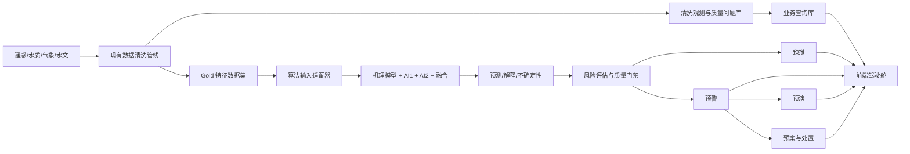
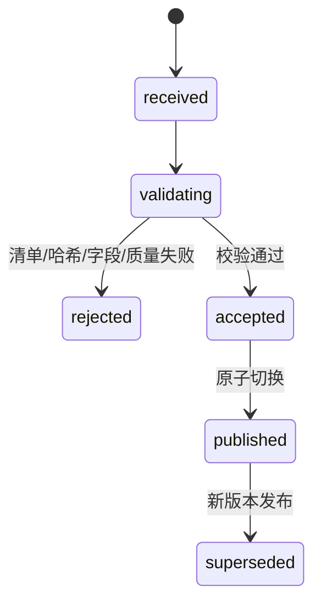
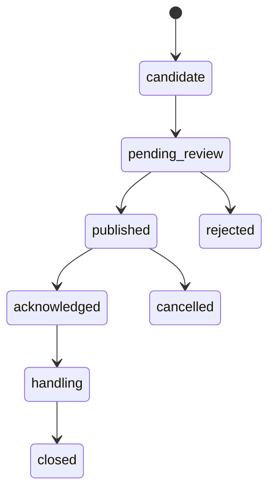
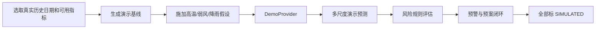
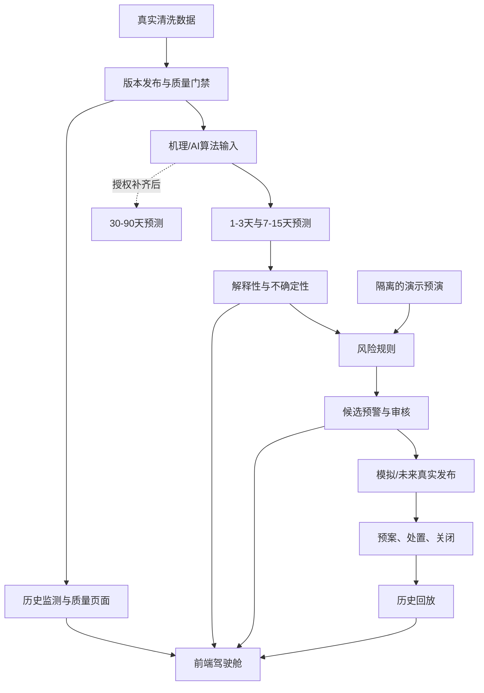

# A23 蓝藻水华监测预警系统：后端完整修改建议（对齐前端、清洗数据与未来算法）

> 适用阶段：数据清洗管线已有真实产物，机理与 AI 算法仍在完善，当前前端主要使用静态演示数据。  
> 核心目标：让后端承接“多源数据治理 → 时空特征 → 机理/AI预测 → 风险分级 → 预警处置 → 历史复盘”，而不是搭建与赛题割裂的通用后台。  
> 边界：本文定义算法接入、结果存储和业务闭环，不替算法团队虚构精度、SHAP 结果或 30—90 天预测能力。

> **最终联调口径**：当前统一加载 `DEMO-OBS-V1` 和 `DEMO-PRED-V1` 两组演示数据，通过 `SimulatedObservationProvider/SimulatedPredictionProvider` 对外服务；未来仅切换为清洗数据 Provider 和成员 C 算法 Provider。字段、API 和前端页面保持不变。具体以《前后端联调与示例数据统一规范》为准。

---

## 1. 核心主线应为：



比赛阶段采用**模块化单体 FastAPI**即可，不应在当前团队规模下拆微服务。

---

## 2. 现有数据真实能力盘点

### 2.1 已经具备的数据

根据仓库现有清洗产物：

- `data_cleaning.db.cleaned_observations`：80,899 条清洗观测；
- 当前包含 4 个来源、13 个空间对象；
- 覆盖气温、风速、降水、水位、总磷、总氮、氨氮、溶解氧、pH、高锰酸盐指数、浮游植物生物量、藻密度等；
- `integrated_daily_features`：23,891 条太湖湖体日尺度记录；
- `integrated_lag_rolling_features`：对 36 类直接变量生成 1/3/7/14/30/90 天滞后与滚动特征，共 1,728 个衍生特征，且记录无时间泄漏；
- `integrated_mechanistic_features`：已有温度响应、Monod 氮磷限制、光照限制、低风指标、前期降雨、水位变化、物候周期等机理特征；
- `integrated_reliability_features`：已有数据年龄、来源数量、代理值、可用比例等可靠性字段；
- 1—3 天训练集：`READY`，192 个真实未来标签；
- 7—15 天训练集：`READY`，576 个真实未来标签；
- 30—90 天训练集：`BLOCKED_AUTH`，缺少 C3S 季节预测回报数据授权；
- Sentinel-2 已有一次实验反演，但仅覆盖部分湖体，叶绿素校准泛化能力低，状态为 `experimental_not_operational`。

### 2.2 当前不能支持的声明

- 不能宣称已有稳定实时水质自动站数据；
- 不能把 2005—2020 年水质数据显示为“今天刚更新”；
- 不能把实验性遥感叶绿素作为监管真值；
- 不能宣称 30—90 天算法已经可用；
- 不能宣称融合模型已较单模型提升 10%；
- 不能把当前六个演示点位自动等同真实站点；
- 不能把无观测覆盖的日期或区域当成低风险/负样本；
- 不能把空气温度无标识地显示成水温；
- 没有可靠流速字段时，不能显示“流速实时更新”。

### 2.3 后端必须提供能力矩阵

```http
GET /api/v1/system/capabilities
```

```json
{
  "data_as_of": "2026-08-24T01:15:10+08:00",
  "capabilities": {
    "historical_observation": "available",
    "short_term_forecast_1_3d": "dataset_ready_model_pending",
    "medium_term_forecast_7_15d": "dataset_ready_model_pending",
    "long_term_forecast_30_90d": "blocked_auth",
    "satellite_chlorophyll": "experimental_not_operational",
    "real_time_warning_dispatch": "not_enabled",
    "demo_warning_dispatch": "available"
  },
  "blockers": [{
    "code": "MISSING_C3S_SEASONAL_HINDCAST",
    "scope": "30_90d",
    "action": "配置 CDS API 并完成季节预测回报数据接入"
  }]
}
```

项目概览、技术路线和驾驶舱均读取该接口，避免完成度表述不一致。

---

## 3. 对齐赛题的后端业务架构

### 3.1 模块划分

```text
backend/
├─ app/
│  ├─ api/v1/
│  │  ├─ capabilities.py      # 能力边界
│  │  ├─ datasets.py          # 数据版本与质量
│  │  ├─ spatial.py           # 站点/湖区/网格
│  │  ├─ observations.py      # 历史监测
│  │  ├─ forecasts.py         # 多尺度预测与解释
│  │  ├─ warnings.py          # 预警生命周期
│  │  ├─ simulations.py       # 未来预演
│  │  └─ plans.py             # 预案与匹配
│  ├─ application/
│  │  ├─ ingestion_service.py
│  │  ├─ observation_service.py
│  │  ├─ feature_dataset_service.py
│  │  ├─ prediction_service.py
│  │  ├─ risk_service.py
│  │  ├─ warning_service.py
│  │  └─ replay_service.py
│  ├─ domain/
│  │  ├─ dataset.py
│  │  ├─ observation.py
│  │  ├─ prediction.py
│  │  ├─ risk.py
│  │  ├─ warning.py
│  │  └─ plan.py
│  ├─ infrastructure/
│  │  ├─ repositories/
│  │  ├─ cleaning_adapter/
│  │  ├─ model_adapter/
│  │  ├─ raster_adapter/
│  │  └─ notification_adapter/
│  └─ workers/
│     ├─ ingest_release.py
│     ├─ run_prediction.py
│     └─ evaluate_warning.py
├─ migrations/
├─ tests/
└─ main.py
```

### 3.2 数据分层

| 层级 | 保存内容 | 当前实现 | 后续实现 |
|---|---|---|---|
| Raw/Silver | 原始文件、标准长表、拒绝记录 | 现有清洗目录 | 对象存储/文件系统 |
| Gold | 日特征、滞后、机理、可靠性、训练集 | Parquet + SQLite | 版本化 Parquet/GeoParquet |
| Operational | 空间对象、观测索引、预测、预警、处置 | 新建 SQLite | PostgreSQL + PostGIS |
| Raster | NDCI/FAI/MCI/实验叶绿素 | GeoTIFF | COG + 元数据目录 |
| Model | 模型版本、参数、指标、产物 | 当前算法 JSON | 后续可接 MLflow |

原则：

- 训练宽表继续使用 Parquet，不把 1,700 多个特征复制成业务宽表；
- 前端所需关键指标通过视图或 API 聚合；
- 数据库保存版本、路径、哈希、状态、字段字典和质量结论；
- 栅格保存 URI、范围、分辨率和质量元数据，不把 GeoTIFF 二进制塞进关系表；
- 真实、实验、模拟数据必须隔离。

---

## 4. 对接清洗字段的数据库设计

### 4.1 数据源、批次和数据集版本

```sql
CREATE TABLE source_dataset (
  id TEXT PRIMARY KEY,
  source_code TEXT NOT NULL,
  source_type TEXT NOT NULL,
  title TEXT NOT NULL,
  license_name TEXT,
  source_url TEXT,
  data_mode TEXT NOT NULL CHECK (data_mode IN ('observed','forecast','experimental','simulated')),
  created_at TIMESTAMP NOT NULL
);

CREATE TABLE ingest_batch (
  id TEXT PRIMARY KEY,
  dataset_id TEXT NOT NULL REFERENCES source_dataset(id),
  run_id TEXT NOT NULL,
  manifest_path TEXT NOT NULL,
  content_sha256 TEXT NOT NULL,
  schema_version TEXT NOT NULL,
  status TEXT NOT NULL CHECK (status IN ('received','validating','accepted','rejected','published')),
  row_count INTEGER,
  min_observed_at TIMESTAMP,
  max_observed_at TIMESTAMP,
  quality_summary JSON,
  created_at TIMESTAMP NOT NULL,
  UNIQUE(dataset_id, content_sha256)
);

CREATE TABLE feature_dataset_version (
  id TEXT PRIMARY KEY,
  dataset_code TEXT NOT NULL,
  run_id TEXT NOT NULL,
  horizon_code TEXT,
  artifact_path TEXT NOT NULL,
  lineage_path TEXT,
  manifest_path TEXT NOT NULL,
  schema_hash TEXT NOT NULL,
  row_count INTEGER NOT NULL,
  leakage_violations INTEGER NOT NULL DEFAULT 0,
  trainable BOOLEAN NOT NULL,
  status TEXT NOT NULL,
  blocker_code TEXT,
  created_at TIMESTAMP NOT NULL,
  UNIQUE(dataset_code, run_id)
);
```

这三张表直接承接现有 `manifest.json`，不再重新定义一套与清洗任务无关的“场景快照”。

### 4.2 空间对象不能全部叫 station

现有数据包含站点、湖体整体、气象格点、流域单元和未来风险网格，应统一为：

```sql
CREATE TABLE spatial_entity (
  id TEXT PRIMARY KEY,
  entity_type TEXT NOT NULL CHECK (
    entity_type IN ('station','buoy','intake','river_section','lake_zone','grid','basin','lake_whole','demo_zone')
  ),
  source_spatial_id TEXT,
  display_name TEXT NOT NULL,
  geometry TEXT,
  geometry_status TEXT NOT NULL DEFAULT 'unverified',
  data_mode TEXT NOT NULL,
  enabled BOOLEAN NOT NULL DEFAULT TRUE,
  metadata JSON
);
```

SQLite 演示版可暂存 GeoJSON；迁移 PostgreSQL 后改为 PostGIS geometry。

当前前端六个对象的处理：

| 前端对象 | 当前真实性 | 后端处理 |
|---|---|---|
| 西北热点区 | 演示业务分区 | `demo_zone`，不得写成真实站点 |
| 入湖河口站 | 无明确源站映射 | 先标 `demo_zone`，确认后再映射 |
| 东南监测站 | 无明确源站映射 | 同上 |
| 湖心浮标 | 无实时浮标证据 | 不显示“连续实时回传” |
| 取水口 | 缺少已验证坐标 | `demo_zone`，核验后升级 `intake` |
| 南部通道 | 演示输运分区 | `demo_zone` |

真实历史站点如 `TAIHU_ZS`、`TAIHU_XK`、`TAIHU_WT` 可进入历史列表，但坐标未补齐前不能强行画到地图。

### 4.3 标准观测表直接承接 cleaned_observations

```sql
CREATE TABLE observation (
  id INTEGER PRIMARY KEY,
  ingest_batch_id TEXT NOT NULL REFERENCES ingest_batch(id),
  spatial_entity_id TEXT REFERENCES spatial_entity(id),
  scene_id TEXT,
  observed_at TIMESTAMP NOT NULL,
  variable_code TEXT NOT NULL,
  observed_value DOUBLE PRECISION,
  clean_value DOUBLE PRECISION,
  unit TEXT,
  value_origin TEXT NOT NULL,
  is_imputed BOOLEAN NOT NULL DEFAULT FALSE,
  imputation_method TEXT,
  imputation_confidence DOUBLE PRECISION,
  quality_flags JSON NOT NULL,
  source_file TEXT NOT NULL,
  source_row TEXT NOT NULL,
  UNIQUE(ingest_batch_id, source_file, source_row, variable_code)
);

CREATE INDEX idx_observation_spatial_variable_time
  ON observation(spatial_entity_id, variable_code, observed_at DESC);
CREATE INDEX idx_observation_variable_time
  ON observation(variable_code, observed_at DESC);
```

| 清洗字段 | 业务字段 | 说明 |
|---|---|---|
| `station_id` | `source_spatial_id` | 通过映射表解析 |
| `scene_id` | `observation.scene_id` | 遥感场景关联 |
| `observed_at` | `observed_at` | 原始观测时间 |
| `observed_value` | `observed_value` | 原值，不覆盖 |
| `clean_value` | `clean_value` | 页面和算法默认使用 |
| `variable_code` | 指标代码 | 如 `total_phosphorus` |
| `value_origin` | 来源性质 | 实测、再分析、代理等 |
| `quality_flags` | 质量标记 | 决定展示与建模资格 |
| `is_imputed` | 插补标志 | 页面必须标识 |

### 4.4 指标字典与单位

```sql
CREATE TABLE variable_dictionary (
  code TEXT PRIMARY KEY,
  display_name TEXT NOT NULL,
  canonical_unit TEXT,
  category TEXT NOT NULL,
  display_precision INTEGER NOT NULL DEFAULT 2,
  operational_role TEXT,
  can_be_target BOOLEAN NOT NULL DEFAULT FALSE,
  warning_enabled BOOLEAN NOT NULL DEFAULT FALSE
);
```

首批登记：

- `air_temperature`、`water_temperature`；
- `wind_speed`、`wind_direction`、`precipitation`；
- `water_level`；
- `total_phosphorus`、`total_nitrogen`、`ammonia_nitrogen`；
- `dissolved_oxygen`、`pH`；
- `phytoplankton_biomass`、`algae_density`；
- `ndci`、`fai`、`mci`；
- `chlorophyll_a_experimental`；
- `bloom_area_partial`。

### 4.5 栅格与地图资产

```sql
CREATE TABLE raster_asset (
  id TEXT PRIMARY KEY,
  ingest_batch_id TEXT REFERENCES ingest_batch(id),
  scene_id TEXT,
  asset_type TEXT NOT NULL,
  uri TEXT NOT NULL,
  bbox JSON,
  crs TEXT,
  resolution_m DOUBLE PRECISION,
  coverage_fraction DOUBLE PRECISION,
  valid_pixel_fraction DOUBLE PRECISION,
  uncertainty JSON,
  operational_use BOOLEAN NOT NULL,
  quality_status TEXT NOT NULL,
  captured_at TIMESTAMP
);
```

现有 Sentinel-2 产物入库时必须保留：

- 湖体覆盖率约 `0.6669`；
- 有效水体像元比例约 `0.9797`；
- 部分覆盖水华面积 `35.0148 km²`；
- 实验叶绿素均值约 `5.6689 μg/L`；
- `operational_use=false`；
- `calibrated_low_generalization`；
- 模型域超出比例、残差不确定性和原因。

---

## 5. 现有前端页面与后端逐页对齐

### 5.1 首页、项目概览、技术路线

后端提供系统能力、数据源类别、时间范围、完成/阻塞项、最新清洗批次和算法版本。禁止前端硬编码“精度提升 10%”。

```http
GET /api/v1/system/capabilities
GET /api/v1/datasets/summary
GET /api/v1/pipeline/runs/latest
```

### 5.2 驾驶舱 `/cockpit`

驾驶舱聚合：

1. 监测态势：最新真实观测、时间、来源和质量；
2. 预测态势：算法存在时返回多尺度预测，否则 `model_pending`；
3. 业务态势：预警、待确认事件、处置和推荐预案。

```http
GET /api/v1/dashboard/overview?as_of=...&mode=historical
```

每个 KPI 自带来源状态：

```json
{
  "data": {"cards": [{
    "code": "latest_total_phosphorus",
    "value": 0.087,
    "unit": "mg/L",
    "observed_at": "2020-10-31T16:00:00Z",
    "data_mode": "observed",
    "freshness": "stale",
    "quality": "pass",
    "spatial_scope": "TAIHU_ZS"
  }]},
  "meta": {"claim_boundary": "historical_evidence_only"}
}
```

### 5.3 监测站 `/stations`

分成两种模式：

- **历史真实站点**：读取清洗库站点、变量、时间范围和质量；
- **业务演示分区**：保留六个演示对象，始终显示 `SIMULATED / 演示分区`。

```http
GET /api/v1/spatial-entities?entity_type=station&mode=observed
GET /api/v1/spatial-entities?entity_type=demo_zone&mode=simulated
GET /api/v1/spatial-entities/{id}/observations
GET /api/v1/spatial-entities/{id}/quality
GET /api/v1/spatial-entities/{id}/forecasts
GET /api/v1/spatial-entities/{id}/explanations
```

| 页面指标 | 当前支持情况 | 返回策略 |
|---|---|---|
| 藻密度 | 仅 16 条，主要是历史湖体数据 | 历史回看，不标实时 |
| 叶绿素 a | 仅实验遥感反演 | 标 `experimental`，不伪造成站点实测 |
| 总磷 | 9 个历史站点，时间截至 2020 | 返回真实时间及 `stale` |
| 水温 | 当前主要是气温 | 不直接替代；若代理则显示“气温（代理）” |

### 5.4 风险热力 `/heatmap`

图层必须区分：

1. `observed_remote_sensing`：遥感观测/反演；
2. `forecast_risk`：算法预测风险；
3. `simulated_scenario`：演示预演结果。

```http
GET /api/v1/map/layers
GET /api/v1/map/raster/{asset_id}/metadata
GET /api/v1/map/risk-polygons?run_id=...&horizon_days=...
GET /api/v1/map/risk-grid?run_id=...&horizon_days=...
```

响应包含空间分辨率、覆盖范围、有效像元比例、预测时效、模型版本、置信区间和决策用途。

### 5.5 历史事件 `/history`

合并三类事件：

- 数据事件：接入、质量异常、缺测、来源切换；
- 模型事件：运行、失败、预测生成、版本切换；
- 业务事件：预警触发、审核、发布、确认、处置、关闭。

```http
GET /api/v1/events?start=...&end=...&event_type=...
GET /api/v1/events/{id}
GET /api/v1/events/{id}/evidence
GET /api/v1/events/{id}/replay
```

### 5.6 页面下钻必须保持上下文

前端跳转保留：`mode`、`as_of`、`spatial_entity_id`、`prediction_run_id`、`horizon_days`。后端使用这些稳定标识，防止热力图与站点页读到不同运行的数据。

---

## 6. 数据清洗结果接入逻辑

### 6.1 不使用无结构 records 上传

正确入口是“清洗发布物接入”：

```http
POST /api/v1/ingestion/releases
```

```json
{
  "run_id": "p12_04_reliability_features",
  "dataset_code": "integrated_reliability_features",
  "manifest_path": "storage/gold/integrated_reliability_features/manifest.json",
  "artifact_path": "storage/gold/integrated_reliability_features/reliability_features.parquet",
  "lineage_path": "storage/gold/integrated_reliability_features/reliability_feature_lineage.csv",
  "schema_version": "1.0.0",
  "content_sha256": "..."
}
```

### 6.2 接入状态机



校验：

1. 路径位于允许的发布目录；
2. manifest 必需字段和状态正确；
3. SHA-256 防重复和篡改；
4. 列名、类型、单位、空间粒度正确；
5. 日期范围与时区正确；
6. 质量、缺失率、来源追溯合格；
7. 训练集 `leakage_violations=0`；
8. 原子写入新版本，不覆盖上一版本；
9. 记录审计和失败原因。

### 6.3 清洗库与业务库关系

- 清洗侧 SQLite/Parquet 是事实来源；
- 后端发布时导入元数据、空间对象和查询索引；
- 特征宽表由算法适配器读取指定版本 Parquet；
- 业务接口不逐次扫描 CSV；
- 前端不能直接访问 `storage/`。

---

## 7. 未来算法接入：对齐成员 C 契约

### 7.1 算法输入绑定数据版本

```python
class PredictionJobRequest(BaseModel):
    feature_dataset_version_id: str
    spatial_entity_ids: list[str]
    as_of: date
    horizons: list[str]  # h1_3d, h7_15d, h30_90d
    target_metrics: list[str]
    model_alias: str = "candidate"
```

前端不能直接提交任意 `features`，否则会造成输入伪造、版本混用、不可复现和数据泄漏。

### 7.2 复用当前算法输出

现有算法样例已包含：空间 ID、预测尺度、声明边界、多日期结果、叶绿素/水华面积/风险等级、风险概率、机理/两种 AI/两种融合输出、特征重要性和不确定性。

后端增加适配器，不重造不兼容 JSON：

```python
class ModelProvider(Protocol):
    def predict(self, request: PredictionJobRequest) -> ModelPredictionContract: ...

class MemberCProvider(ModelProvider):
    """调用 blue_algae_m7，并映射现有算法契约。"""

class DemoProvider(ModelProvider):
    """仅用于演示，强制 claim_boundary=simulation_only。"""
```

### 7.3 模型与预测结果表

```sql
CREATE TABLE model_version (
  id TEXT PRIMARY KEY,
  model_family TEXT NOT NULL,
  version TEXT NOT NULL,
  artifact_uri TEXT,
  training_dataset_id TEXT REFERENCES feature_dataset_version(id),
  metrics JSON,
  effect_claim_allowed BOOLEAN NOT NULL DEFAULT FALSE,
  status TEXT NOT NULL,
  created_at TIMESTAMP NOT NULL,
  UNIQUE(model_family, version)
);

CREATE TABLE prediction_run (
  id TEXT PRIMARY KEY,
  model_version_id TEXT NOT NULL REFERENCES model_version(id),
  feature_dataset_id TEXT NOT NULL REFERENCES feature_dataset_version(id),
  as_of DATE NOT NULL,
  provider_type TEXT NOT NULL CHECK (provider_type IN ('algorithm','simulation')),
  status TEXT NOT NULL,
  claim_boundary TEXT NOT NULL,
  started_at TIMESTAMP NOT NULL,
  finished_at TIMESTAMP,
  error_code TEXT,
  error_message TEXT
);

CREATE TABLE forecast_result (
  id TEXT PRIMARY KEY,
  prediction_run_id TEXT NOT NULL REFERENCES prediction_run(id),
  spatial_entity_id TEXT NOT NULL REFERENCES spatial_entity(id),
  forecast_date DATE NOT NULL,
  horizon_days INTEGER NOT NULL,
  risk_probability DOUBLE PRECISION,
  risk_level TEXT,
  lower_bound DOUBLE PRECISION,
  upper_bound DOUBLE PRECISION,
  confidence DOUBLE PRECISION,
  quality_gate TEXT NOT NULL,
  UNIQUE(prediction_run_id, spatial_entity_id, forecast_date)
);

CREATE TABLE forecast_metric (
  forecast_result_id TEXT NOT NULL REFERENCES forecast_result(id),
  metric_code TEXT NOT NULL,
  metric_value DOUBLE PRECISION,
  metric_text TEXT,
  unit TEXT,
  lower_bound DOUBLE PRECISION,
  upper_bound DOUBLE PRECISION,
  PRIMARY KEY(forecast_result_id, metric_code)
);

CREATE TABLE explanation_contribution (
  forecast_result_id TEXT NOT NULL REFERENCES forecast_result(id),
  feature_code TEXT NOT NULL,
  importance DOUBLE PRECISION NOT NULL,
  direction TEXT,
  explanation_method TEXT NOT NULL,
  rank_no INTEGER NOT NULL,
  PRIMARY KEY(forecast_result_id, feature_code, explanation_method)
);
```

### 7.4 多尺度能力门禁

| 时间尺度 | 当前状态 | 后端行为 |
|---|---|---|
| 1—3 天 | 数据集 READY，算法待正式训练 | 可跑接口流程；标 `sample_interface_only` |
| 7—15 天 | 数据集 READY，算法待正式训练 | 同上，不声明正式精度 |
| 30—90 天 | `BLOCKED_AUTH` | 返回 `CAPABILITY_UNAVAILABLE`，真实模式禁用 |

禁止用短期结果外推 90 天并冒充长期预测。

---

## 8. 风险评估与分级预警

### 8.1 预测不等于预警

```text
预测结果 → 数据质量门禁 → 风险规则 → 候选预警
         → 人工审核/演示确认 → 发布 → 确认 → 处置 → 关闭复盘
```

数据质量异常进入 `data_quality_alert`，不能升级为水华预警。

### 8.2 风险规则配置化

```sql
CREATE TABLE warning_rule (
  id TEXT PRIMARY KEY,
  name TEXT NOT NULL,
  scope_type TEXT NOT NULL,
  target_metric TEXT NOT NULL,
  horizon_min_days INTEGER NOT NULL,
  horizon_max_days INTEGER NOT NULL,
  condition_json JSON NOT NULL,
  min_confidence DOUBLE PRECISION,
  required_quality TEXT NOT NULL,
  warning_level TEXT NOT NULL,
  cooldown_hours INTEGER NOT NULL DEFAULT 24,
  version TEXT NOT NULL,
  enabled BOOLEAN NOT NULL DEFAULT TRUE
);
```

阈值来源必须标记为赛题演示规则、地方预案、专家确认或模型校准。未确认前只能使用 `demo_rule_v1`，页面显示“演示分级规则”。

```json
{
  "all": [
    {"field": "risk_probability", "op": ">=", "value": 0.70},
    {"field": "quality_gate", "op": "=", "value": "pass"},
    {"field": "confidence", "op": ">=", "value": 0.60}
  ],
  "persistence": {"consecutive_runs": 2},
  "dedup_key": ["spatial_entity_id", "warning_level", "forecast_window"]
}
```

### 8.3 预警证据链与状态机

```sql
CREATE TABLE warning_event (
  id TEXT PRIMARY KEY,
  rule_id TEXT NOT NULL REFERENCES warning_rule(id),
  prediction_run_id TEXT REFERENCES prediction_run(id),
  spatial_entity_id TEXT NOT NULL REFERENCES spatial_entity(id),
  warning_level TEXT NOT NULL,
  title TEXT NOT NULL,
  status TEXT NOT NULL,
  trigger_value JSON NOT NULL,
  claim_boundary TEXT NOT NULL,
  first_triggered_at TIMESTAMP NOT NULL,
  published_at TIMESTAMP,
  closed_at TIMESTAMP,
  version INTEGER NOT NULL DEFAULT 1
);

CREATE TABLE warning_evidence (
  id TEXT PRIMARY KEY,
  warning_event_id TEXT NOT NULL REFERENCES warning_event(id),
  evidence_type TEXT NOT NULL,
  evidence_ref_id TEXT NOT NULL,
  summary JSON NOT NULL,
  created_at TIMESTAMP NOT NULL
);

CREATE TABLE warning_action_log (
  id TEXT PRIMARY KEY,
  warning_event_id TEXT NOT NULL REFERENCES warning_event(id),
  action TEXT NOT NULL,
  from_status TEXT,
  to_status TEXT,
  operator_id TEXT NOT NULL,
  channel TEXT,
  simulated BOOLEAN NOT NULL,
  detail JSON,
  created_at TIMESTAMP NOT NULL
);
```



### 8.4 “四预”闭环

| 四预 | 后端实体 | 前端效果 |
|---|---|---|
| 预报 | `prediction_run`、`forecast_result` | 多尺度曲线、指标、不确定性 |
| 预警 | `warning_rule`、`warning_event` | 分级颜色、证据、状态 |
| 预演 | `simulation_run`、`simulation_frame` | 时间轴、热区迁移、基线对比 |
| 预案 | `emergency_plan`、`plan_match`、`warning_action_log` | 推荐措施、确认、处置、复盘 |

预演不能修改真实预测，只记录“基线 + 假设 + 输出”：

```sql
CREATE TABLE simulation_run (
  id TEXT PRIMARY KEY,
  base_prediction_run_id TEXT REFERENCES prediction_run(id),
  name TEXT NOT NULL,
  assumptions JSON NOT NULL,
  provider_type TEXT NOT NULL,
  data_mode TEXT NOT NULL DEFAULT 'simulated',
  created_by TEXT NOT NULL,
  created_at TIMESTAMP NOT NULL
);
```

---

## 9. 预案管理与通知

首批三类演示预案：

1. 重点湖湾加密监测；
2. 取水口联动保护；
3. 强降雨后入湖河口巡查与控源。

```sql
CREATE TABLE emergency_plan (
  id TEXT PRIMARY KEY,
  code TEXT NOT NULL UNIQUE,
  name TEXT NOT NULL,
  applicable_levels JSON NOT NULL,
  applicable_scopes JSON NOT NULL,
  trigger_tags JSON NOT NULL,
  steps JSON NOT NULL,
  owner_role TEXT,
  version TEXT NOT NULL,
  status TEXT NOT NULL
);
```

匹配依据：风险等级、空间类型、预测时效、主要驱动、取水口关联和数据可信度。

比赛环境的 `POST /warnings/{id}/dispatch` 只写发送记录，返回 `simulated=true`；不保存真实联系方式，不调用外部短信网关。未来真实通知需模板审核、频控、重试、回执、脱敏和审批。

---

## 10. 完整 API 建议

统一前缀 `/api/v1`，统一响应：

```json
{
  "data": {},
  "meta": {
    "request_id": "req_...",
    "generated_at": "2026-08-24T10:00:00+08:00",
    "data_mode": "observed",
    "dataset_version_id": "...",
    "prediction_run_id": null,
    "claim_boundary": "historical_evidence_only"
  },
  "errors": []
}
```

### 10.1 系统与数据

| 方法 | 路径 | 用途 |
|---|---|---|
| GET | `/system/capabilities` | 能力、阻塞项、声明边界 |
| GET | `/datasets/summary` | 数据源、字段、范围、质量 |
| GET | `/datasets/{id}` | 数据版本和血缘 |
| POST | `/ingestion/releases` | 接入清洗发布物 |
| GET | `/ingestion/batches/{id}` | 接入进度与错误 |
| GET | `/pipeline/runs/latest` | 最新清洗运行状态 |

### 10.2 空间与观测

| 方法 | 路径 | 用途 |
|---|---|---|
| GET | `/spatial-entities` | 站点、分区、网格 |
| GET | `/spatial-entities/{id}` | 空间详情 |
| GET | `/spatial-entities/{id}/observations` | 指标时序 |
| GET | `/spatial-entities/{id}/quality` | 完整率、时效、插补、异常 |
| GET | `/variables` | 指标字典 |

### 10.3 预测与解释

| 方法 | 路径 | 用途 |
|---|---|---|
| POST | `/prediction-runs` | 创建算法运行，仅后台/管理员 |
| GET | `/prediction-runs/{id}` | 运行状态和版本 |
| GET | `/forecasts` | 按空间、时效、指标查询 |
| GET | `/forecasts/{id}` | 单条预测详情 |
| GET | `/forecasts/{id}/explanations` | 驱动贡献与方法 |
| GET | `/forecast-capabilities` | 各时间尺度可用性 |

### 10.4 地图与预演

| 方法 | 路径 | 用途 |
|---|---|---|
| GET | `/map/layers` | 图层目录和能力 |
| GET | `/map/raster/{id}/metadata` | 栅格元数据与限制 |
| GET | `/map/risk-grid` | 风险格网 |
| GET | `/map/risk-polygons` | 风险分区 GeoJSON |
| POST | `/simulation-runs` | 创建预演 |
| GET | `/simulation-runs/{id}/frames` | 时间帧、轨迹、面积变化 |

### 10.5 预警、事件和预案

| 方法 | 路径 | 用途 |
|---|---|---|
| GET | `/warnings` | 筛选预警 |
| GET | `/warnings/{id}` | 预警与证据 |
| POST | `/warnings` | 根据预测运行、空间对象和规则创建候选预警 |
| POST | `/warnings/{id}/submit-review` | 提交审核 |
| POST | `/warnings/{id}/publish` | 发布/模拟发布 |
| POST | `/warnings/{id}/dispatch` | 模拟/真实通知适配器发送并记录回执 |
| POST | `/warnings/{id}/acknowledge` | 确认接收 |
| POST | `/warnings/{id}/actions` | 记录处置 |
| POST | `/warnings/{id}/close` | 关闭并填写结论 |
| GET | `/warnings/{id}/recommended-plans` | 推荐预案 |
| GET | `/plans` | 查询可用应急预案 |
| GET | `/events` | 历史事件时间线 |
| GET | `/events/{id}/replay` | 事件回放 |

### 10.6 关键错误码

| HTTP | code | 场景 |
|---|---|---|
| 400 | `INVALID_QUERY_RANGE` | 时间范围错误 |
| 404 | `SPATIAL_ENTITY_NOT_FOUND` | 空间对象不存在 |
| 409 | `CAPABILITY_UNAVAILABLE` | 30—90 天未就绪 |
| 409 | `DATASET_VERSION_CONFLICT` | 混用数据版本 |
| 422 | `QUALITY_GATE_FAILED` | 质量不允许预测/预警 |
| 422 | `SCHEMA_VALIDATION_FAILED` | 发布物字段不匹配 |
| 503 | `MODEL_PROVIDER_UNAVAILABLE` | 算法服务不可用 |

---

## 11. 模拟数据的正确位置

模拟数据仅用于前后端联调、答辩“四预”演示和自动化测试。

1. 以真实字段字典和单位为模板；
2. 只为缺失的未来预测、风险网格和处置事件生成演示数据；
3. 观测历史优先使用真实清洗数据；
4. 模拟结果写入 `provider_type=simulation` 的独立运行；
5. 固定 seed 保证可复现；
6. 每个响应和页面显示 `SIMULATED`；
7. 模拟 SHAP 只能写“规则贡献/演示贡献”；
8. 重置演示只清理模拟运行和模拟预警，绝不删除真实观测。



---

## 12. 数据质量门禁

质量必须参与查询、算法和预警：

1. **展示门禁**：失败数据不进 KPI；警告数据带标识；
2. **模型门禁**：`fail`、不可追溯或空间粒度不符时不能进入正式模型；
3. **预警门禁**：数据陈旧、不确定性过大或模型未批准时只能生成候选研判。

```json
{
  "quality": {
    "status": "warning",
    "freshness": "stale",
    "observed_count": 1,
    "source_count": 1,
    "is_imputed": false,
    "value_origin": "historical_observation",
    "proxy_flag": false,
    "limitations": ["latest observation is older than configured freshness threshold"]
  }
}
```

---

## 13. 安全、权限和审计

| 角色 | 权限 |
|---|---|
| `viewer` | 查看观测、预测、图层、事件 |
| `analyst` | 创建预演、提交候选预警、填写研判 |
| `admin` | 发布预警、接入数据、切换模型、重置演示 |

必须实现：

- JWT/OIDC 或最小演示账号认证；
- 所有写接口鉴权；
- 发布路径白名单，防目录穿越；
- 请求体大小限制；
- 严格枚举指标、时效、模式；
- 不向前端泄露堆栈、绝对路径、凭据；
- 状态变更使用乐观锁，防重复发布；
- 日志包含操作者、对象、前后状态、时间、request ID；
- `.env.cdse` 等凭据不得进入接口、日志或 Git；
- CSV 导出防公式注入。

---

## 14. 性能与稳定性

- 观测按空间对象、指标、时间建立复合索引；
- 趋势接口限制范围和点数，支持日/周/月聚合；
- 地图返回 GeoJSON 或瓦片，不返回整幅 GeoTIFF；
- 预测、数据发布、栅格处理放后台任务；
- 预测运行提供状态轮询；
- 同数据版本与查询条件可短 TTL 缓存；
- API 设置超时、分页和最大 `page_size`；
- 算法失败不影响历史观测查询；
- 长任务幂等并记录重试次数；
- 应用启动时不重新生成全部演示数据。

比赛部署：SQLite + 本地文件 + 单进程后台任务。  
后续生产化：PostgreSQL/PostGIS + 对象存储 + Redis/任务队列，API 契约保持不变。

---

## 15. 测试体系

### 15.1 数据契约

- 清洗观测字段映射完整；
- manifest、哈希和路径校验；
- 单位字典一致；
- `leakage_violations=0`；
- 真实、实验、模拟不能混写；
- 未知标签不能转换为 0；
- 30—90 天阻塞不能返回伪预测。

### 15.2 业务测试

- 数据质量告警不触发水华预警；
- 重复评估不生成重复预警；
- 预警只按合法状态流转；
- 未审核预警不能发布；
- 模拟发送不调用真实通知；
- 关闭事件必须有处置结论；
- 历史事件可追溯到预测、数据版本和证据。

### 15.3 前后端契约

- 驾驶舱、站点、热力、历史使用同一 `prediction_run_id`；
- 单位和精度来自字典；
- 空状态、能力阻塞、模型失败有明确错误码；
- `SIMULATED`、`experimental`、`stale` 在页面可见；
- 切换站点和时间轴不串数据；
- OpenAPI 生成前端类型，CI 检查破坏性变更。

---

## 16. 分阶段整改计划

### P0：先完成统一演示数据联调（3—5 天）

1. 加载 `sample-data/simulated_observations_v1.csv` 和 `simulated_api_fixture_v1.json`；
2. 新建 capabilities、dashboard、spatial-entities、observations、quality 接口；
3. 接通 forecasts、explanations、risk-polygons；
4. 六个前端对象统一为 `demo_zone`；
5. 全部响应返回 `data_mode=simulated`、`DEMO-OBS-V1`、`DEMO-PRED-V1`；
6. 页面显示 `SIMULATED`、非决策用途和数据版本；
7. 接口失败时禁止回退另一份本地 Mock。

效果：四个核心页面使用同一份假数据顺畅联调，且不会被误认为真实结论。

### P1：完成预警与预案闭环（4—6 天）

1. 实现候选预警创建、审核、发布和模拟发送；
2. 实现确认、处置、关闭；
3. 实现三类演示预案和自动匹配；
4. 历史页读取持久化业务事件；
5. 保证数据质量告警不触发蓝藻业务预警。

效果：形成可演示、可追溯的预警处置闭环。

### P2：替换为真实清洗数据（4—7 天）

1. 实现 `CleanedObservationProvider`；
2. 从 `data_cleaning.db` 和已发布 Parquet 读取真实数据；
3. 建指标字典、站点/分区映射和数据集版本；
4. 接入质量报告、来源健康和阻塞项；
5. 将响应模式切换为 `observed/experimental`，前端 API 不变。

效果：只切换 Provider 即完成演示数据到真实数据的替换。

### P3：接入成员 C 算法（5—8 天）

1. 实现 `MemberCModelProvider`；
2. 建模型版本、运行、指标、解释和不确定性表；
3. 接通 1—3 天和 7—15 天；
4. 30—90 天未就绪时继续显示阻塞；
5. 模型通过验收后启用正式风险规则；
6. 保留演示 Provider 用于测试，不再作为真实页面自动回退。

效果：算法版本替换不要求修改前端，并形成真实“预报—预警—预演—预案”闭环。

### P4：地图与生产增强

1. 核验真实站点坐标与湖区对象；
2. GeoTIFF 转 COG，接动态瓦片；
3. PostgreSQL/PostGIS；
4. 模型注册与任务队列；
5. 真实通知接入前完成权限和合规评审。

---

## 17. 最终验收清单

- [ ] 前端通过 API 获取数据，不再依赖 `script.js` 静态业务对象；
- [ ] 六个演示对象明确为 `demo_zone`；
- [ ] 历史站点、演示分区、遥感场景、风险网格可区分；
- [ ] 每个数值包含单位、时间、模式和质量；
- [ ] 气温代理不显示成真实水温；
- [ ] 实验叶绿素显示覆盖率、不确定性和非业务用途；
- [ ] 三类预测时效状态真实；
- [ ] 算法输出可追溯至模型和特征数据集版本；
- [ ] 风险预测、质量告警、正式预警为不同实体；
- [ ] 预警包含规则、证据、审核、发送、确认、处置、关闭；
- [ ] 模拟数据永不写入真实观测表；
- [ ] 预演始终标记 `SIMULATED`；
- [ ] 历史回放可复原数据版本、模型运行和处置；
- [ ] OpenAPI、迁移、契约测试和核心业务测试进入 CI。

---

## 18. 参考项目与实际借鉴点

### 18.1 HydroServer

[hydroserver2/hydroserver](https://github.com/hydroserver2/hydroserver)

借鉴环境监测站点、数据流、时间序列、元数据、质量管理和数据编排的领域划分；不照搬其完整 Django 架构。

### 18.2 OGC SensorThings API / FROST-Server

[OGC SensorThings API](https://github.com/opengeospatial/sensorthings)  
[FraunhoferIOSB/FROST-Server](https://github.com/FraunhoferIOSB/FROST-Server)

借鉴站点/设备/观测分离、统一观测接口和 GeoJSON 扩展。比赛阶段不必完整实现 OData。

### 18.3 TiTiler

[developmentseed/titiler](https://github.com/developmentseed/titiler)

借鉴通过 FastAPI 为 COG/STAC/Zarr 提供动态瓦片，而不是用 JSON 返回整幅遥感文件。P4 再接入。

### 18.4 MLflow

[mlflow/mlflow](https://github.com/mlflow/mlflow)

借鉴模型运行、数据版本、指标、产物和生命周期。当前先实现最小表，算法稳定后再接 MLflow。

---

## 19. 最终效果



最终呈现的是：真实数据可追溯、能力边界清楚、算法接口可替换、多尺度状态真实、解释与不确定性可展示、质量参与决策、预警与预案形成闭环；算法未完成时仍可演示，但不会把模拟结果冒充真实成果。
